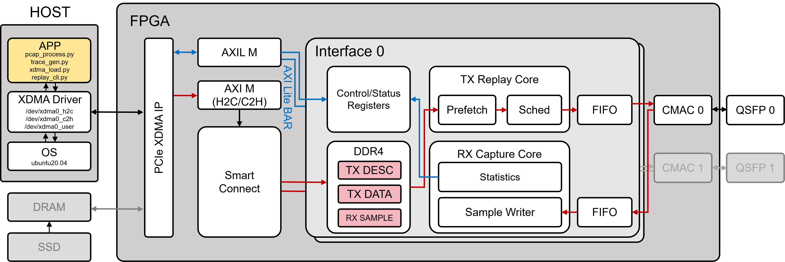
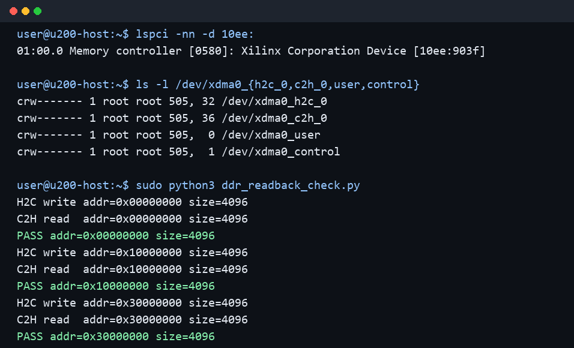
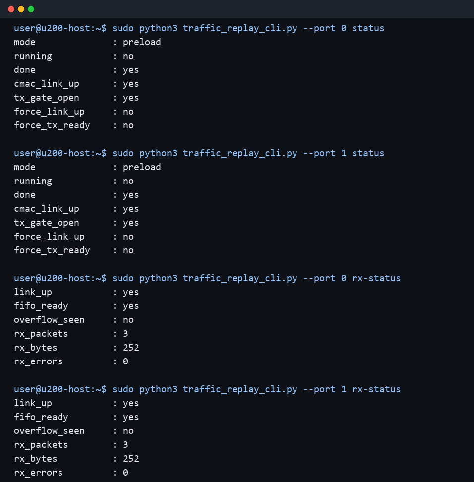
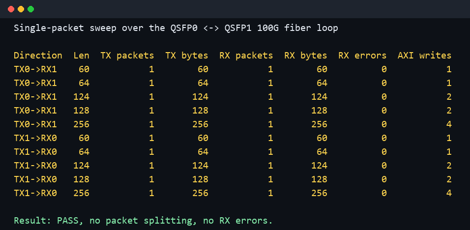
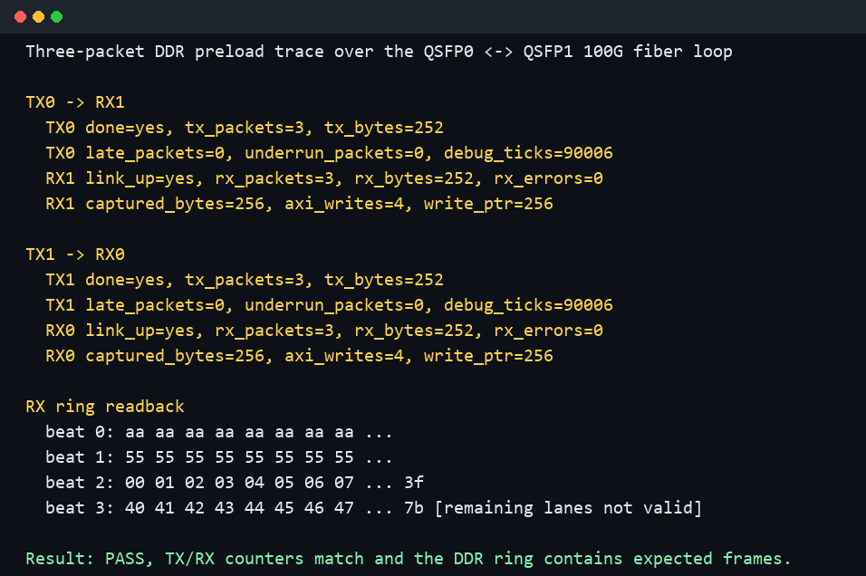

<div align="center">

<h1>Tick Replayer</h1>

<p><strong>DDR-backed dual-port 100G FPGA traffic replay prototype for Xilinx Alveo U200.</strong></p>

<p>
  <code>FPGA</code> /
  <code>100G Ethernet</code> /
  <code>Xilinx Alveo U200</code> /
  <code>PCIe XDMA</code> /
  <code>DDR4</code> /
  <code>CMAC</code> /
  <code>PCAP replay</code>
</p>

</div>

## Overview

`Tick Replayer` loads packet descriptors and payload data from a Linux host into
FPGA `DDR4` through `PCIe XDMA`, then replays the traffic through 100G `CMAC`
ports with descriptor-controlled inter-packet timing.

The current design is a dual-port prototype.  `QSFP0` and `QSFP1` each have an
independent transmit replay pipeline, and each receive side has a lightweight
statistics and recent-packet capture path.  The two `QSFP` ports can transmit
and receive at the same time, which is the behavior needed when one FPGA
emulates both sides of a bidirectional trace around a network device under test.

This repository is source-oriented: it contains `RTL`, Vivado Tcl scripts,
constraints, simulation, host utilities, documentation, verification
screenshots, and selected archived bitstreams with matching TXT notes.  Vivado
generated projects, build logs, temporary traces, and private machine state are
intentionally excluded.

## Table of Contents

* [Features](#features)
* [System Architecture](#system-architecture)
* [FPGA Datapath](#fpga-datapath)
* [Trace Descriptor Format](#trace-descriptor-format)
* [Repository Layout](#repository-layout)
* [Requirements](#requirements)
* [Build](#build)
* [Bitstream Archive](#bitstream-archive)
* [Programming and PCIe Rescan](#programming-and-pcie-rescan)
* [Host Tools](#host-tools)
* [Stream Mode and Stress Testing](#stream-mode-and-stress-testing)
* [Verification](#verification)
* [Current Limitations](#current-limitations)

## Features

* `Xilinx Alveo U200` target.
* `PCIe Gen3 x16` endpoint based on Xilinx `XDMA`.
* One memory-mapped `H2C`/`C2H` `XDMA` path for `DDR4` access.
* `AXI-Lite` control plane through the `XDMA` user `BAR`.
* `DDR4`-backed trace storage for descriptors and payloads.
* Dual 100G `CMAC` datapath:
  * `TX0` replay core to `QSFP0`.
  * `TX1` replay core to `QSFP1`.
  * `RX0` capture/stat core from `QSFP0`.
  * `RX1` capture/stat core from `QSFP1`.
* Descriptor format with per-packet gap, payload offset, frame length, and flags.
* Replay modes:
  * `PRELOAD`: host preloads descriptor and payload files into `DDR4`.
  * `LOOP`: `DDR4`-backed replay loop is wired in `RTL`.
  * `STREAM`: host writes a stream buffer into `DDR4` through memory-mapped
    `XDMA H2C`; the FPGA reads it sequentially and feeds the stream parser.
* Host-side Python tools for `pcap` conversion, `XDMA` loading, control registers,
  status registers, and RX capture configuration.
* Verified `QSFP0` <-> `QSFP1` 100G optical loop with bidirectional `TX`/`RX`
  counters and `DDR4` ring readback.

## System Architecture

### Block Diagram



Block diagram of the `Tick Replayer` FPGA traffic replay system.  `APP`:
host-side application scripts for `pcap` processing, trace generation, `XDMA`
loading, and replay control; `XDMA Driver`: Xilinx DMA Linux driver exposing
`H2C`, `C2H`, and user `BAR` character devices; `PCIe XDMA IP`: Xilinx PCI
Express DMA endpoint; `AXIL M`: `AXI-Lite` master used by `XDMA` to access
control and status registers; `AXI M`: memory-mapped AXI master used for `H2C`
and `C2H` DDR access; `H2C`: host-to-card DMA; `C2H`: card-to-host DMA; `BAR`:
PCIe base address register window used for `AXI-Lite` control; `SmartConnect`:
Xilinx AXI interconnect/arbitration fabric; `DDR4`: FPGA external memory used
for `TX` descriptors, `TX` payload data, and `RX` sample rings; `TX DESC`:
transmit packet descriptor storage; `TX DATA`: transmit packet payload storage;
`RX SAMPLE`: truncated receive sample ring storage; `TX Replay Core`:
descriptor/payload prefetch, replay scheduler, and transmit packet engine;
`Sched`: replay scheduler driven by descriptor packet gaps; `RX Capture Core`:
receive statistics and sample writer; `FIFO`: `AXI-Stream` clock-domain crossing
and buffering; `CMAC`: Xilinx 100G Ethernet MAC; `QSFP`: 100G optical
transceiver port.  The diagram shows one replay/capture interface slice; the
dual-port build instantiates the same logical `TX`/`RX` path for the active
`CMAC`/`QSFP` ports.

The host prepares replay traces and controls the FPGA through `PCIe`.  The FPGA
stores traces in `DDR4` and uses independent per-port replay cores to feed the
100G `CMAC` transmit interfaces.  The receive side does not upload every packet
to the host; it keeps counters and optionally writes a truncated recent-packet
window into `DDR4` so that software can inspect selected data through `XDMA C2H`.

High-level data movement:

```text
PCAP / generated trace
  -> pcap2trace.py
  -> desc.bin + data.bin + manifest.json
  -> xdma_load_trace.py
  -> /dev/xdma0_h2c_0
  -> FPGA DDR4
  -> per-port descriptor reader / payload reader
  -> replay scheduler
  -> TX packet engine
  -> AXI-Stream async FIFO
  -> 100G CMAC TX
  -> QSFP0 / QSFP1
```

DDR-backed `STREAM` movement:

```text
desc.bin + data.bin
  -> trace_to_stream.py
  -> stream.bin
  -> xdma_stream_load.py
  -> /dev/xdma0_h2c_0
  -> FPGA DDR4 stream buffer
  -> ddr_stream_reader
  -> host_stream_parser
  -> replay scheduler
  -> TX packet engine
  -> 100G CMAC TX
```

Control and debug movement:

```text
traffic_replay_cli.py
  -> /dev/xdma0_user
  -> XDMA AXI-Lite master
  -> control SmartConnect
  -> TX/RX control and status registers

RX capture DDR ring
  -> /dev/xdma0_c2h_0
  -> host-side debug readback
```

## FPGA Datapath

The Vivado block design is generated by `scripts/create_hw_project.tcl`.
The major IP and RTL blocks are:

| Block | Role |
| --- | --- |
| `XDMA` | `PCIe Gen3 x16` endpoint.  Provides memory-mapped `H2C`/`C2H` DMA and an `AXI-Lite` master for `BAR`-mapped registers. |
| `DDR4 MIG` | U200 `DDR4 C0` memory controller.  Stores `TX` descriptors, `TX` payloads, and `RX` capture rings. |
| `SmartConnect` | Arbitrates host DMA, `TX` readers, and `RX` ring writers into `DDR4`; also routes `AXI-Lite` control accesses. |
| `trace_replay_core` | Per-port `TX` replay core with `AXI-Lite` registers, `DDR4` trace reader, scheduler, and `TX` engine. |
| `ddr_trace_reader` | Reads 64-byte descriptors and payload beats from `DDR4`. |
| `ddr_stream_reader` | Reads a sequential stream buffer from `DDR4` for `STREAM` mode. |
| `host_stream_parser` | Parses one 64-byte stream header beat followed by packet payload beats. |
| `replay_scheduler` | Maintains a replay-relative tick counter and releases packets according to descriptor gap fields. |
| `replay_tx_engine` | Converts scheduled payload beats into 512-bit `CMAC TX AXI-Stream` frames. |
| `axis_async_fifo` | Crosses between the `DDR4` UI clock and `CMAC` user clocks. |
| `rx_capture_bd_core` | Per-port `RX` statistics and truncated `DDR4` ring capture. |
| `CMAC0` / `CMAC1` | 100G Ethernet MACs connected to `QSFP0` and `QSFP1`. |

Current `AXI-Lite` map:

```text
0x00000 - 0x0ffff  TX0 replay registers
0x10000 - 0x1ffff  TX1 replay registers
0x20000 - 0x2ffff  RX0 capture/stat registers
0x30000 - 0x3ffff  RX1 capture/stat registers
0x40000 - 0x4ffff  DDR4 controller control window
```

TX/RX port connections:

```text
TX0: replay_core_0 -> tx_axis_fifo_0 -> CMAC0 TX -> QSFP0
TX1: replay_core_1 -> tx_axis_fifo_1 -> CMAC1 TX -> QSFP1

RX0: QSFP0 -> CMAC0 RX -> rx_cap_0 -> DDR ring writer
RX1: QSFP1 -> CMAC1 RX -> rx_cap_1 -> DDR ring writer
```

## Trace Descriptor Format

`PRELOAD` and `LOOP` replay modes use two binary files:

* `desc.bin`: one fixed-size descriptor per packet.
* `data.bin`: packet payload bytes, padded to 64-byte AXI data beats.

Each descriptor is exactly 64 bytes, little-endian, and naturally aligned to one
512-bit AXI beat.  The hardware descriptor reader fetches descriptor `N` from:

```text
descriptor_address = DESC_BASE + N * 64
```

Descriptor byte layout:

| Byte offset | RTL bits | Field | Width | Description |
| --- | --- | --- | --- | --- |
| `0x00` | `[63:0]` | `gap_ticks` | 64 bits | Inter-packet gap in replay clock ticks.  With `START_TIME=0`, the first packet is released after the first descriptor gap. |
| `0x08` | `[95:64]` | `data_word_offset` | 32 bits | Payload offset from `DATA_BASE`, measured in 64-byte words. |
| `0x0c` | `[111:96]` | `frame_len` | 16 bits | Number of valid frame bytes to transmit.  FCS is not stored; CMAC inserts FCS on TX. |
| `0x0e` | `[127:112]` | `flags` | 16 bits | Reserved for future per-packet options.  Current tools write `0`. |
| `0x10` | `[511:128]` | `reserved` | 48 bytes | Reserved.  Must be written as zero for forward compatibility. |

Equivalent packed C layout:

```c
struct replay_desc {
    uint64_t gap_ticks;
    uint32_t data_word_offset;
    uint16_t frame_len;
    uint16_t flags;
    uint8_t  reserved[48];
};
```

The payload start address is computed by the FPGA as:

```text
payload_address = DATA_BASE + data_word_offset * 64
payload_beats   = ceil(frame_len / 64)
```

`data.bin` stores each packet payload at a 64-byte boundary.  If `frame_len` is
not a multiple of 64, the host pads the remaining bytes in the final beat, and
the TX engine generates `TKEEP` from `frame_len` so that only valid bytes are
transmitted.  The current `pcap2trace.py` default pads short frames to 60 bytes
and does not store Ethernet FCS.

Example descriptors from the three-packet smoke trace:

| Packet | `gap_ticks` | `data_word_offset` | `frame_len` | `flags` |
| --- | ---: | ---: | ---: | ---: |
| 0 | `30000` | `0` | `64` | `0` |
| 1 | `30000` | `1` | `64` | `0` |
| 2 | `30000` | `2` | `124` | `0` |

`STREAM` mode uses a DDR-backed stream buffer.  The buffer is a linear sequence
of packet records:

```text
64-byte stream header for packet 0
64-byte-aligned payload for packet 0
64-byte stream header for packet 1
64-byte-aligned payload for packet 1
...
```

The stream header uses the same first 16 bytes as `replay_desc`:
`gap_ticks`, `frame_len`, and `flags` are consumed by the FPGA stream parser.
`data_word_offset` is ignored in `STREAM` mode and should be written as `0`.
The payload immediately follows the header and is padded to a 64-byte boundary.
The FPGA reads exactly `TRACE_BYTES` bytes from `DESC_BASE`, so the host must
program `DESC_BASE` as the stream-buffer base address and `TRACE_BYTES` as the
full stream-buffer size.

## Repository Layout

```text
bitstreams/    Selected archived bitstreams plus per-version TXT notes
constraints/   U200 and stub XDC constraints
docs/images/   Architecture and verification screenshots
rtl/           SystemVerilog/Verilog replay, CDC, and RX capture RTL
scripts/       Vivado project creation, simulation, implementation, programming
sim/           XSim testbench
software/      Host-side pcap conversion, XDMA loader, and control CLI
```

## Requirements

FPGA build host:

* Windows host tested with `Vivado 2020.2`.
* Xilinx licenses for `CMAC`, `XDMA`, `DDR4`, and related IP.
* PowerShell environment capable of running the scripts in `scripts/`.

Target machine:

* Linux host with an `Alveo U200` installed.
* Xilinx `XDMA` reference driver.
* Remote `hw_server` for JTAG programming.
* Two `QSFP` 100G optical ports.  The current smoke test uses a `QSFP0` <->
  `QSFP1` fiber loop.

## Build

Create the Vivado hardware project:

```powershell
$env:TRAFFIC_REPLAY_HW_BUILD_ROOT="D:\tr_build_dual"
$env:TRAFFIC_REPLAY_ENABLE_ILA="0"
powershell -ExecutionPolicy Bypass -File .\scripts\run_vivado.ps1 -Action hwbd
```

Open the project in Vivado GUI:

```powershell
& D:\Xilinx\Vivado\2020.2\bin\vivado.bat D:\tr_build_dual\vivado_hw\traffic_replay_hw.xpr
```

Run implementation and write the bitstream:

```powershell
$env:TRAFFIC_REPLAY_HW_BUILD_ROOT="D:\tr_build_dual"
$env:TRAFFIC_REPLAY_ENABLE_ILA="0"
powershell -ExecutionPolicy Bypass -File .\scripts\run_vivado.ps1 -Action hwbit_existing
```

The generated bitstream is written under the selected build root:

```text
%TRAFFIC_REPLAY_HW_BUILD_ROOT%\vivado_hw\traffic_replay_hw.runs\impl_1\traffic_replay_bd_wrapper.bit
```

The latest verified build completed with bitgen `0 Errors`; the final timing
summary met user constraints with WNS `+0.007 ns`.

## Bitstream Archive

Important hardware images are archived under `bitstreams/`.  Each version should
include the `.bit` file, the matching `.ltx` file when available, and a TXT note
with the source commit, SHA256 hash, build root, and verification status.

Archive a generated bitstream from PowerShell:

```powershell
powershell -ExecutionPolicy Bypass -File .\scripts\archive_bitstream.ps1 `
  -Bitfile D:\tr_build_dual\vivado_hw\traffic_replay_hw.runs\impl_1\traffic_replay_bd_wrapper.bit `
  -Ltx D:\tr_build_dual\vivado_hw\traffic_replay_hw.runs\impl_1\traffic_replay_bd_wrapper.ltx `
  -Name pre_stream_dual_qsfp_loop_verified `
  -BuildRoot D:\tr_build_dual `
  -Notes "H2C/C2H DDR readback passed; TX0->RX1 and TX1->RX0 loopback passed."
```

The archived TXT file is the audit trail for that hardware image.  Before
programming an old bitstream, compare its recorded SHA256 hash with the local
file.

## Programming and PCIe Rescan

Program the U200 through the remote hardware server:

```powershell
powershell -ExecutionPolicy Bypass -File .\scripts\run_vivado.ps1 `
  -Action program `
  -Bitfile "$env:TRAFFIC_REPLAY_HW_BUILD_ROOT\vivado_hw\traffic_replay_hw.runs\impl_1\traffic_replay_bd_wrapper.bit"
```

After programming a PCIe endpoint through JTAG, the Linux host must rescan PCIe
or reboot.  A typical rescan sequence is:

```bash
sudo rmmod xdma 2>/dev/null || true
echo 1 | sudo tee /sys/bus/pci/devices/0000:01:00.0/remove
echo 1 | sudo tee /sys/bus/pci/rescan
sudo insmod /home/user/dma_ip_drivers/XDMA/linux-kernel/xdma/xdma.ko
lspci -nn -d 10ee:
ls -l /dev/xdma*
```

Expected PCIe device ID:

```text
01:00.0 Memory controller [0580]: Xilinx Corporation Device [10ee:903f]
```

## Host Tools

Convert a classic pcap to the replay trace format:

```bash
python3 /home/user/traffic_replay_software/pcap2trace.py \
  /home/user/input.pcap \
  --out-dir /home/user/trace_out \
  --tick-hz 300000000
```

The converter creates:

```text
desc.bin
data.bin
manifest.json
```

Load a trace to TX0 and start `PRELOAD` replay:

```bash
sudo python3 /home/user/traffic_replay_software/xdma_load_trace.py \
  --port 0 \
  --manifest /home/user/trace_out/manifest.json \
  --desc-base 0x00000000 \
  --data-base 0x10000000 \
  --mode preload
```

Load a trace to TX1 with a separate DDR address range:

```bash
sudo python3 /home/user/traffic_replay_software/xdma_load_trace.py \
  --port 1 \
  --manifest /home/user/trace_out/manifest.json \
  --desc-base 0x01000000 \
  --data-base 0x11000000 \
  --mode preload
```

Convert a descriptor/data trace into a `STREAM` buffer:

```bash
python3 /home/user/traffic_replay_software/trace_to_stream.py \
  --manifest /home/user/trace_out/manifest.json \
  --out /home/user/trace_out/stream.bin
```

Load the stream buffer and start `STREAM` replay:

```bash
sudo python3 /home/user/traffic_replay_software/xdma_stream_load.py \
  --port 0 \
  --manifest /home/user/trace_out/stream_manifest.json \
  --stream-base 0x20000000
```

Generate a synthetic trace for controlled testing:

```bash
python3 /home/user/traffic_replay_software/gen_synthetic_trace.py \
  --out-dir /home/user/synth_64B \
  --packet-count 100000 \
  --frame-len 64 \
  --gap-ticks 0
```

Query status:

```bash
sudo python3 /home/user/traffic_replay_software/traffic_replay_cli.py --port 0 status
sudo python3 /home/user/traffic_replay_software/traffic_replay_cli.py --port 1 status
sudo python3 /home/user/traffic_replay_software/traffic_replay_cli.py --port 0 rx-status
sudo python3 /home/user/traffic_replay_software/traffic_replay_cli.py --port 1 rx-status
```

Configure RX capture rings:

```bash
sudo python3 /home/user/traffic_replay_software/traffic_replay_cli.py \
  --port 0 rx-config --ring-base 0x32000000 --ring-size 0x00100000 --truncate-bytes 128
sudo python3 /home/user/traffic_replay_software/traffic_replay_cli.py --port 0 rx-clear
sudo python3 /home/user/traffic_replay_software/traffic_replay_cli.py --port 0 rx-enable
sudo python3 /home/user/traffic_replay_software/traffic_replay_cli.py --port 0 rx-capture on

sudo python3 /home/user/traffic_replay_software/traffic_replay_cli.py \
  --port 1 rx-config --ring-base 0x30000000 --ring-size 0x00100000 --truncate-bytes 128
sudo python3 /home/user/traffic_replay_software/traffic_replay_cli.py --port 1 rx-clear
sudo python3 /home/user/traffic_replay_software/traffic_replay_cli.py --port 1 rx-enable
sudo python3 /home/user/traffic_replay_software/traffic_replay_cli.py --port 1 rx-capture on
```

`RX` capture writes complete 64-byte beats to `DDR4`.  `rx_bytes` is the meaningful
byte count derived from `TKEEP`, while `captured_bytes` is the number of 64-byte
ring bytes written.  The unused lanes at the end of the final beat are not valid
packet bytes.

## Stream Mode and Stress Testing

Current `STREAM` mode is DDR-backed.  The host still uses the memory-mapped
`XDMA H2C` device to write a linear stream buffer into `DDR4`; the FPGA
`ddr_stream_reader` then reads that buffer in 512-bit AXI bursts and feeds
`host_stream_parser`.  This keeps the stable `XDMA`/`DDR4` block design intact
while exercising the stream parser, scheduler, and `TX` engine with a continuous
packet stream.

Run a max-throughput sweep with synthetic zero-gap packets:

```bash
sudo python3 /home/user/traffic_replay_software/stream_stress_test.py \
  --port 0 \
  --frame-sizes 64,128,256,512,1024,1518 \
  --packet-count 100000 \
  --gap-ticks 0 \
  --stream-base 0x20000000 \
  --csv /home/user/stream_stress.csv
```

Useful debug switches:

* `--force-link-up`: open the replay gate even when the `CMAC` link is down.
* `--force-tx-ready`: drain the replay core when the downstream `CMAC`/FIFO path
  is not ready.  This is useful for logic-only bring-up, but it bypasses the
  real transmit backpressure path and should not be used for final throughput
  numbers.

The stress script reports:

* `load_gbps`: host-to-DDR DMA load rate for the generated stream buffer.
* `hw_gbps`: FPGA replay throughput computed from `tx_bytes` and the hardware
  replay tick counter.
* `late_packets` and `underrun_packets`: scheduler and payload starvation
  indicators.

Latest hardware results are recorded in
[`docs/stream_mode_test_20260627.md`](docs/stream_mode_test_20260627.md).  The
test used the archived bitstream
`bitstreams/20260627_014343_stream_prefetch_lutram_fifo_dual_qsfp_impl/`,
programmed onto the U200, with `QSFP0` and `QSFP1` connected by 100G fiber.

Zero-gap `STREAM` sweep on TX0:

| Frame bytes | Packets | Completed | TX packets | TX bytes | Replay Gbps | Load Gbps | Underrun count |
| ---: | ---: | :---: | ---: | ---: | ---: | ---: | ---: |
| `64` | `100000` | yes | `100000` | `6400000` | `17.328` | `7.011` | `0` |
| `128` | `100000` | yes | `100000` | `12800000` | `23.104` | `13.789` | `249960` |
| `256` | `100000` | yes | `100000` | `25600000` | `27.725` | `15.961` | `892300` |
| `512` | `100000` | yes | `100000` | `51200000` | `30.807` | `17.641` | `2258888` |
| `1024` | `100000` | yes | `100000` | `102400000` | `32.619` | `18.786` | `4947916` |
| `1518` | `100000` | yes | `100000` | `151800000` | `32.882` | `11.983` | `7692989` |

The current maximum measured zero-gap replay rate is about `32.9 Gbps` for
1518-byte frames.  A conservative no-underrun scheduled point for 1518-byte
frames was observed at `gap_ticks=480`, about `7.59 Gbps`.

## Verification

Run `RTL` simulation:

```powershell
powershell -ExecutionPolicy Bypass -File .\scripts\run_vivado.ps1 -Action sim
```

The current `XSim` testbench covers:

* Host stream parser path: emits 2 packets.
* DDR-backed `STREAM` buffer path: emits 2 packets from an AXI read memory
  model.
* `DDR4` preload path: emits 3 packets from an AXI read memory model.

Run syntax checks for the host tools:

```powershell
python -m py_compile `
  software\traffic_replay_cli.py `
  software\xdma_load_trace.py `
  software\xdma_stream_load.py `
  software\pcap2trace.py `
  software\trace_to_stream.py `
  software\gen_synthetic_trace.py `
  software\stream_stress_test.py
```

Run basic `XDMA` `DDR4` readback after programming:

```bash
sudo python3 ddr_readback_check.py
```

Representative output:



Check dual-port link and `RX` status after connecting `QSFP0` and `QSFP1` with a
100G fiber:



Run a single-packet length sweep over both directions:



Run the three-packet DDR preload trace over both directions:



The latest hardware smoke test proves:

* Host `H2C`/`C2H` DMA can read and write `DDR4`.
* `AXI-Lite` register access works through the `XDMA` user `BAR`.
* `TX0` and `TX1` can read descriptors and payloads from `DDR4`.
* The scheduler and `TX` engine release packets and update counters.
* DDR-backed `STREAM` mode passes `RTL` simulation; hardware throughput testing
  is done with `stream_stress_test.py`.
* `QSFP0` and `QSFP1` `CMAC` links come up over the 100G optical loop.
* `TX0` -> `RX1` and `TX1` -> `RX0` both preserve packet count and byte count.
* Multi-beat packets up to at least 256 bytes are not split after the `FIFO`
  read-latency fix.
* `RX` capture writes a readable recent-packet window into `DDR4`.
* DDR-backed `STREAM` replay now runs on hardware.  TX0 zero-gap stress tests
  complete for `64` through `1518` byte synthetic packets, and RX1 loopback
  counters plus DDR sample ring readback were verified.

## Current Limitations

* The design has not yet been optimized for sustained `100Gbps` replay.  The
  latest zero-gap `STREAM` sweep measured about `32.9Gbps` for 1518-byte frames.
* The `DDR4` trace reader is intentionally simple; descriptor caching, payload
  prefetch, deeper FIFOs, and multiple outstanding reads are future work.
* `STREAM` mode is currently DDR-backed through memory-mapped `XDMA H2C`.  The
  FPGA stream source uses simple single-burst read sequencing, so large-packet
  zero-gap tests can report `underrun_packets`.  A true direct `XDMA`/`QDMA`
  AXI4-Stream `H2C` endpoint, or a deeper multi-outstanding DDR stream source,
  is future work.
* `RX` capture is a statistics and recent-packet debug window, not a full-rate
  packet recorder.
* The current `pcap` converter supports classic `pcap`, not `pcapng`.
* End-to-end testing through the target DDoS protection appliance is still a
  future integration step.
