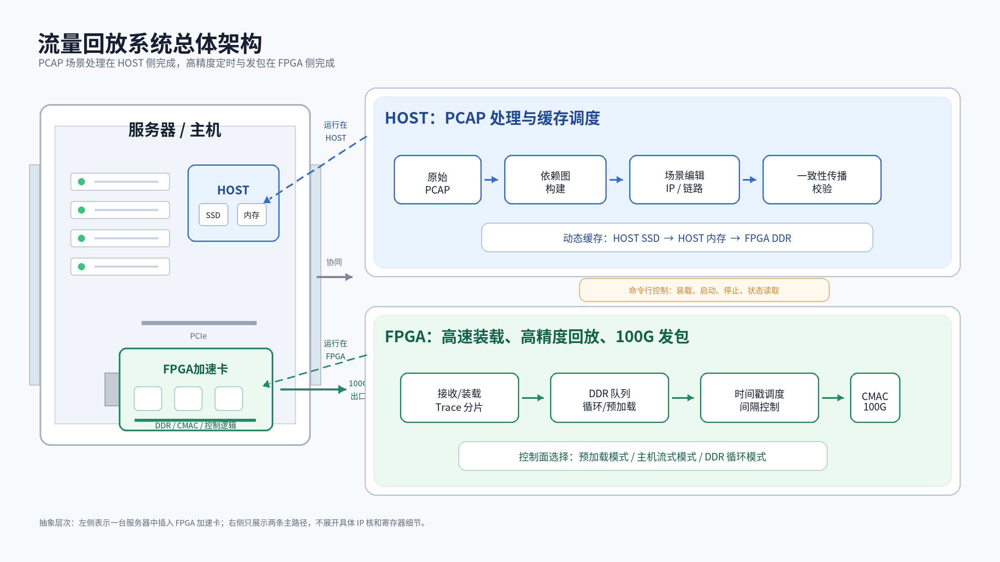

# Tick Replayer

这是一个面向 Xilinx Alveo U200 的 FPGA 流量回放原型工程。第一阶段已经把单端口 100Gbps 回放链路跑通：主机把处理后的 trace 通过 PCIe XDMA 写入 FPGA DDR4，FPGA 按 descriptor 里的包间隔从 DDR4 读出数据，再经 512-bit AXI4-Stream 送到 CMAC TX。当前版本在这个基础上扩展成双端口原型：QSFP0/QSFP1 各有一套独立 TX replay core，RX 侧各有一套统计和截断包缓存入口。

当前版本重点解决的是硬件主链路、双端口硬件框架和可复现工程管理，不是完整商业仪器。已经验证的主路径是 `PRELOAD` DDR 预加载回放；`LOOP` DDR 循环回放 RTL 已接入；`STREAM` 的 parser RTL 已保留，但当前 BD 还没有把 XDMA/QDMA H2C streaming 接进来。



## 当前状态

已经完成并验证：

- Vivado 2020.2 脚本化生成 U200 Block Design。
- PCIe XDMA Gen3 x16 endpoint，设备 ID 固定为 `10ee:903f`。
- Host 通过 `/dev/xdma0_h2c_0` 和 `/dev/xdma0_c2h_0` 对 FPGA DDR4 做 memory-mapped DMA。
- Host 通过 `/dev/xdma0_user` 访问 replay core 的 AXI-Lite 控制寄存器。
- FPGA 从 DDR4 读取 descriptor 和 payload，并按 `gap_ticks` 调度发包。
- 无光纤时通过 `force_link_up` 和 `force_tx_ready` 验证 DDR reader、scheduler、TX engine 的内部通路。
- 双端口 BD 已生成并烧录：QSFP0/QSFP1 各自连接一套 replay core、TX async FIFO、CMAC 和 RX capture core。
- 双端口无光纤 TX smoke test 通过：TX0/TX1 分别从不同 DDR 地址装载同一 3 包 trace，均完成 `tx_packets=3`、`tx_bytes=252`。
- RX0/RX1 的 AXI-Lite 寄存器、ring base/size/truncate 配置、enable/capture 状态读写已通过；因为暂未接光纤，RX 包计数尚未做真实链路验证。
- XSim 仿真覆盖 host stream path 和 DDR preload path。
- 远端 U200 JTAG 烧录、PCIe rescan、XDMA driver probe、DDR H2C/C2H 回读和 3 包 DDR preload smoke test 均通过。

暂未完成或仍需加强：

- XDMA/QDMA streaming H2C 直连 `STREAM` 模式的 BD 接线。
- 接真实光纤后的 CMAC link-up、线速发包和外部网卡收包验证。
- 大 pcap 长时间压力测试和 100Gbps 极限吞吐优化。
- RX 侧真实收包统计、DDR ring 写入和 Host 读取最近包窗口验证。
- pcapng 支持。当前 `software/pcap2trace.py` 只支持 classic pcap。
- 更完整的 traffic_replay 风格高层 CLI，例如一条命令完成 pcap 转换、加载、启动和状态轮询。

## 双端口版本说明

双端口版本仍然只使用一套 XDMA endpoint 和一组 H2C/C2H char device。Host 通过 XDMA memory-mapped H2C 把每个端口要回放的 descriptor/data 写入 DDR4 的不同地址，再通过 `/dev/xdma0_user` 中的不同 AXI-Lite 地址段控制两个逻辑端口。

AXI-Lite 地址空间：

```text
0x00000 - 0x0ffff  TX0 replay registers
0x10000 - 0x1ffff  TX1 replay registers
0x20000 - 0x2ffff  RX0 capture/stat registers
0x30000 - 0x3ffff  RX1 capture/stat registers
0x40000 - 0x4ffff  DDR4 controller control window
```

双端口数据路径：

```text
TX0: replay_core_0 -> tx_axis_fifo_0 -> cmac_0/axis_tx -> QSFP0
TX1: replay_core_1 -> tx_axis_fifo_1 -> cmac_1/axis_tx -> QSFP1

RX0: cmac_0/rx_axis_* -> rx_cap_0 -> DDR ring writer
RX1: cmac_1/rx_axis_* -> rx_cap_1 -> DDR ring writer
```

RX capture 当前是“统计 + 截断保存最近数据”的原型：CMAC RX AXIS 先进入异步 FIFO，再跨到 DDR UI clock 域。启用 capture 后，每个包最多写入 `TRUNC_BYTES` 字节到 DDR ring，ring 以 64B beat 为单位前进并在 `RING_SIZE` 内回绕。这个实现用于 bring-up 和后续扩展入口，暂时不是满速抓包器。

## 仓库结构

```text
rtl/          FPGA replay core RTL
sim/          XSim testbench
constraints/  U200 和 stub 约束
scripts/      Vivado 工程生成、仿真、综合、实现、烧录、ILA 脚本
software/     Host 侧 pcap 转 trace、XDMA 加载、控制 CLI
docs/         架构说明、内部 bring-up 笔记、架构图
```

仓库只保存可复现工程需要的源码、约束、脚本、仿真、软件和文档。Vivado 生成物、bitstream、日志、临时 trace、密码、私钥和 license 文件不进入仓库。

## 系统架构

整体数据流如下：

```text
pcap
  -> software/pcap2trace.py
  -> desc.bin + data.bin
  -> software/xdma_load_trace.py
  -> XDMA H2C
  -> FPGA DDR4
  -> ddr_trace_reader
  -> replay_scheduler
  -> replay_tx_engine
  -> axis_async_fifo
  -> CMAC QSFP0 TX
```

控制流如下：

```text
software/traffic_replay_cli.py
  -> /dev/xdma0_user
  -> XDMA AXI-Lite master
  -> axi_lite_regs.sv
  -> mode/base/count/start/status/debug
```

Block Design 中的主要 IP 和连接：

```text
XDMA M_AXI
  -> AXI clock converter
  -> DDR SmartConnect
  -> DDR4 C0

XDMA M_AXI_LITE
  -> AXI-Lite clock converter
  -> control SmartConnect
  -> replay_core/S_AXIL
  -> DDR4 control register slice

replay_core/M_AXI
  -> DDR SmartConnect
  -> DDR4 C0

replay_core/M_TX_AXIS
  -> axis_async_fifo
  -> CMAC QSFP0 AXIS TX
```

当前 replay core 跑在 DDR4 UI clock 域，TX 输出通过 `axis_async_fifo.v` 跨到 CMAC TX user clock 域。这样做便于早期 bring-up，因为 Host 写 DDR 和 replay core 读 DDR 都在同一内存时钟体系内。后续如果继续追求极限时间精度，可以把 scheduler/TX 前移到 CMAC TX user clock 域，并在 DDR reader 后增加更深的 descriptor/payload 预取队列。

## 主要 RTL 模块

| 模块 | 文件 | 作用 |
| --- | --- | --- |
| 顶层核心 | `rtl/trace_replay_core.sv` | 连接 AXI-Lite、DDR reader、host stream parser、scheduler 和 TX engine |
| 控制寄存器 | `rtl/axi_lite_regs.sv` | Host 控制面，包含模式、地址、包数、loop、debug、状态计数 |
| DDR reader | `rtl/ddr_trace_reader.sv` | 从 DDR 读取 64B descriptor，再按 descriptor 读取 payload |
| 调度器 | `rtl/replay_scheduler.sv` | 使用回放相对 tick，根据 `gap_ticks` 释放每个包 |
| TX engine | `rtl/replay_tx_engine.sv` | 把 payload AXIS 和 packet metadata 组合成 CMAC TX AXIS |
| CDC FIFO | `rtl/axis_async_fifo.v` | DDR UI clock 到 CMAC TX clock 的 AXIS 跨时钟 FIFO |
| Stream parser | `rtl/host_stream_parser.sv` | 预留给未来 host streaming H2C 模式 |
| BD wrapper | `rtl/traffic_replay_bd_core.v` | 给 Vivado BD 例化的 RTL wrapper |
| 公共定义 | `rtl/traffic_replay_pkg.sv` | 宽度、descriptor 常量、keep 生成等 |
| Stub top | `rtl/traffic_replay_top_stub.sv` | 快速综合检查用的简化顶层 |

## Trace 格式

`PRELOAD` 和 `LOOP` 模式使用两个连续文件：

- `desc.bin`：每个包一个 64B descriptor。
- `data.bin`：payload 按 64B 对齐连续存放。

descriptor 小端格式：

```c
struct replay_desc {
    uint64_t gap_ticks;
    uint32_t data_word_offset;  // 64B word offset from DATA_BASE
    uint16_t frame_len;
    uint16_t flags;
    uint8_t  reserved[48];
};
```

当前硬件 tick 来自 DDR UI clock，生成 trace 时建议使用：

```powershell
python .\software\pcap2trace.py .\input.pcap --out-dir .\trace_out --tick-hz 300000000
```

`RATE_Q16_16` 暂时保留，硬件还没有实现动态速率缩放。需要改变回放速率时，建议先在 Host 侧预处理 `gap_ticks`。

## 控制寄存器

AXI-Lite 数据宽度为 32 bit：

```text
0x0000 CONTROL        bit0 start, bit1 stop, bit2 clear counters, bit3 pause
0x0004 MODE           0 preload, 1 stream, 2 loop
0x0008 STATUS         bit0 running, bit1 done, bit2 late, bit3 underrun,
                      bit4 physical_cmac_link_up, bit5 tx_gate_open
0x0010 DESC_BASE_LO
0x0014 DESC_BASE_HI
0x0018 DATA_BASE_LO
0x001c DATA_BASE_HI
0x0020 TRACE_BYTES_LO
0x0024 TRACE_BYTES_HI
0x0028 PKT_COUNT_LO
0x002c PKT_COUNT_HI
0x0030 LOOP_COUNT_LO  0 means infinite loop
0x0034 LOOP_COUNT_HI
0x0038 LOOP_GAP_LO
0x003c LOOP_GAP_HI
0x0040 START_TIME_LO  0 means start after first descriptor gap
0x0044 START_TIME_HI
0x0048 RATE_Q16_16    reserved
0x004c WATERMARK
0x0050 FIFO_LEVEL
0x0054 DEBUG_CTRL     bit0 force_link_up, bit1 force_tx_ready
0x0060 TX_PKTS_LO
0x0064 TX_PKTS_HI
0x0068 TX_BYTES_LO
0x006c TX_BYTES_HI
0x0070 LATE_PKTS_LO
0x0074 LATE_PKTS_HI
0x0078 UNDERRUN_PKTS_LO
0x007c UNDERRUN_PKTS_HI
0x0080 DEBUG_STATUS
0x0084 DEBUG_AXI
0x0088 DEBUG_AR_LO
0x008c DEBUG_AR_HI
0x0090 DEBUG_RDATA
0x0094 DEBUG_TICK_LO
0x0098 DEBUG_TICK_HI
```

`DEBUG_STATUS[3:0]` 是 `ddr_trace_reader` 状态：`0 IDLE`、`1 DESC_AR`、`2 DESC_R`、`3 META`、`4 PAYLOAD_AR`、`5 PAYLOAD_R`、`6 NEXT`、`7 DONE`。`DEBUG_AXI` 低位记录 AXI read channel 的 `arvalid/arready/rvalid/rready/rlast/rresp/arlen`，用于判断 replay core 是否真正向 DDR 发起读请求。

## 复现环境

我使用的环境：

- Windows 主机：Vivado 2020.2
- Vivado 路径：`D:\Xilinx\Vivado\2020.2\bin\vivado.bat`
- FPGA 板卡：Xilinx Alveo U200
- 远端 Linux：Ubuntu，插 U200，并运行 hw_server
- XDMA driver：Xilinx XDMA reference driver v2020.2.2

需要注意：

- CMAC、XDMA、DDR4 等 IP 需要相应 license。
- JTAG 烧录 PCIe endpoint 后，Linux 侧必须重新枚举 PCIe 设备。可以重启，也可以 remove/rescan。
- 不要把密码、私钥或 license 文件提交到仓库。

## Vivado 工程生成

从源码重新生成 U200 Block Design：

```powershell
$env:TRAFFIC_REPLAY_HW_BUILD_ROOT="D:\tr_build"
$env:TRAFFIC_REPLAY_ENABLE_ILA="0"
powershell -ExecutionPolicy Bypass -File .\scripts\run_vivado.ps1 -Action hwbd
```

打开 Vivado GUI：

```powershell
& D:\Xilinx\Vivado\2020.2\bin\vivado.bat D:\tr_build\vivado_hw\traffic_replay_hw.xpr
```

完整生成 bitstream：

```powershell
$env:TRAFFIC_REPLAY_HW_BUILD_ROOT="D:\tr_build"
$env:TRAFFIC_REPLAY_ENABLE_ILA="0"
powershell -ExecutionPolicy Bypass -File .\scripts\run_vivado.ps1 -Action hwbit_existing
```

`TRAFFIC_REPLAY_ENABLE_ILA=0` 是为了降低 Vivado 实现阶段内存压力。需要 CMAC TX ILA 时可以设置为 `1`，但实现时间和内存占用会增加。

## 仿真和快速检查

运行 XSim：

```powershell
powershell -ExecutionPolicy Bypass -File .\scripts\run_vivado.ps1 -Action sim
```

当前 testbench 会验证：

- host stream path 输出 2 个包。
- DDR preload path 输出 3 个包。

运行 stub 综合检查：

```powershell
powershell -ExecutionPolicy Bypass -File .\scripts\run_vivado.ps1 -Action synth
```

## 烧录和 PCIe 重新枚举

远程 JTAG 烧录：

```powershell
powershell -ExecutionPolicy Bypass -File .\scripts\run_vivado.ps1 -Action program -Bitfile D:\tr_build\vivado_hw\traffic_replay_hw.runs\impl_1\traffic_replay_bd_wrapper.bit
```

如果使用的是我当前本机已经验证过的构建，bitstream 路径是：

```text
D:\tr_build_fix\vivado_hw\traffic_replay_hw.runs\impl_1\traffic_replay_bd_wrapper_bscan.bit
```

当前双端口原型验证过的构建路径是：

```text
D:\tr_build_dual\vivado_hw\traffic_replay_hw.xpr
D:\tr_build_dual\vivado_hw\traffic_replay_hw.runs\impl_1\traffic_replay_bd_wrapper.bit
```

这版 bitstream 已经烧录到远程 U200，PCIe rescan 后枚举为 `10ee:903f`，XDMA 设备节点恢复正常。实现日志里 bitgen 为 0 Errors；最终 timing summary 显示 user constraints met。

JTAG 重配后，远端 Linux 需要重新枚举 PCIe。最稳妥是重启；本次验证中也使用过 remove/rescan：

```bash
sudo rmmod xdma 2>/dev/null || true
echo 1 | sudo tee /sys/bus/pci/devices/0000:01:00.0/remove
echo 1 | sudo tee /sys/bus/pci/rescan
```

然后重新加载 XDMA driver：

```bash
sudo insmod /home/user/dma_ip_drivers/XDMA/linux-kernel/xdma/xdma.ko
lspci -nn -d 10ee:
ls -l /dev/xdma*
```

期望能看到：

```text
01:00.0 Memory controller [0580]: Xilinx Corporation Device [10ee:903f]
/dev/xdma0_h2c_0
/dev/xdma0_c2h_0
/dev/xdma0_user
```

如果没有重新枚举，XDMA 可能读到 `0xffffffff` engine id，H2C/C2H 会报 `Errno 512` 或 `Failed to detect XDMA config BAR`。

## Host 侧回放流程

先把软件脚本放到远端 Linux，例如：

```bash
mkdir -p /home/user/traffic_replay_software
```

生成 trace：

```bash
python3 /home/user/traffic_replay_software/pcap2trace.py \
  /home/user/input.pcap \
  --out-dir /home/user/trace_out \
  --tick-hz 300000000
```

停止并清空状态：

```bash
sudo python3 /home/user/traffic_replay_software/traffic_replay_cli.py stop
sudo python3 /home/user/traffic_replay_software/traffic_replay_cli.py clear
```

加载 trace 到 DDR 并启动 `PRELOAD`：

```bash
sudo python3 /home/user/traffic_replay_software/xdma_load_trace.py \
  --manifest /home/user/trace_out/manifest.json \
  --desc-base 0x00000000 \
  --data-base 0x10000000 \
  --mode preload
```

无光纤调试时，可以让内部 TX path drain：

```bash
sudo python3 /home/user/traffic_replay_software/xdma_load_trace.py \
  --manifest /home/user/trace_out/manifest.json \
  --desc-base 0x00000000 \
  --data-base 0x10000000 \
  --mode preload \
  --force-link-up \
  --force-tx-ready
```

查询状态：

```bash
sudo python3 /home/user/traffic_replay_software/traffic_replay_cli.py status
sudo python3 /home/user/traffic_replay_software/traffic_replay_cli.py regs
```

## 已验证现象

本地：

- XSim 通过：host stream replay 2 包、DDR preload replay 3 包。
- Stub 综合通过。
- 完整 U200 bitstream 生成成功。
- BSCAN/JTAG 配置模式 bitstream 烧录成功，Vivado 报告 `End of startup status: HIGH`。

远端 U200：

- PCIe remove/rescan 后枚举为 `10ee:903f`。
- XDMA driver v2020.2.2 probe 成功，识别 `config bar 1, user 0`。
- H2C/C2H DDR 回读通过：
  - `0x00020000`，4KB，PASS。
  - `0x00200000`，64KB，PASS。
  - `0x11000000`，256KB，PASS。
- 3 包 DDR preload smoke trace 通过：
  - `done=yes`
  - `tx_packets=3`
  - `tx_bytes=252`
  - `late_packets=0`
  - `underrun_packets=0`
  - `debug_ticks=90006`

这说明当前已经证明：Host 能通过 XDMA 写 DDR，FPGA replay core 能从 DDR 读 descriptor/payload，scheduler 能按相对时间释放包，TX engine 能把包推出到 TX 输出侧。没有接光纤时，这还不等价于 QSFP 光口真实发包；真实发包仍需要 CMAC link-up 和外部收包验证。

## 版本管理

上传 GitHub 前可以用这个脚本导出一份源码快照：

```powershell
powershell -ExecutionPolicy Bypass -File .\scripts\export_github_sources.ps1 -Zip
```

推荐直接使用 Git 管理源码，提交范围保持清楚：

```text
RTL 行为变更
Vivado/IP/BD 脚本变更
Host 软件和寄存器协议变更
文档和测试向量变更
```

不要提交：

```text
.Xil/
build/
reports/
artifacts/
traffic_replay.cache/
traffic_replay.hw/
traffic_replay.ip_user_files/
traffic_replay.sim/
*.bit
*.ltx
*.jou
*.log
usage_statistics_webtalk.*
```

更多底层 bring-up 细节见 [docs/PROJECT_BRINGUP_NOTES.md](docs/PROJECT_BRINGUP_NOTES.md)。

## 双端口 smoke test 记录

远程 U200 烧录双端口 bitstream 后，先做 DDR H2C/C2H 回读：

```text
0x00000000 4KB      PASS
0x00100000 64KB     PASS
0x10000000 1MB      PASS
0x30000000 4KB      PASS
```

TX0 无光纤回放：

```bash
sudo python3 /home/user/traffic_replay_software/xdma_load_trace.py \
  --port 0 \
  --manifest /home/user/trace_out/manifest.json \
  --desc-base 0x00000000 \
  --data-base 0x10000000 \
  --mode preload \
  --force-link-up \
  --force-tx-ready
sudo python3 /home/user/traffic_replay_software/traffic_replay_cli.py --port 0 status
```

现象：

```text
done=yes
tx_packets=3
tx_bytes=252
late_packets=0
underrun_packets=0
```

TX1 无光纤回放：

```bash
sudo python3 /home/user/traffic_replay_software/xdma_load_trace.py \
  --port 1 \
  --manifest /home/user/trace_out/manifest.json \
  --desc-base 0x01000000 \
  --data-base 0x11000000 \
  --mode preload \
  --force-link-up \
  --force-tx-ready
sudo python3 /home/user/traffic_replay_software/traffic_replay_cli.py --port 1 status
```

现象同 TX0：`tx_packets=3`、`tx_bytes=252`。

RX0/RX1 ring 配置示例：

```bash
sudo python3 /home/user/traffic_replay_software/traffic_replay_cli.py --port 0 rx-config --ring-base 0x20000000 --ring-size 0x00100000 --truncate-bytes 128
sudo python3 /home/user/traffic_replay_software/traffic_replay_cli.py --port 0 rx-clear
sudo python3 /home/user/traffic_replay_software/traffic_replay_cli.py --port 0 rx-enable
sudo python3 /home/user/traffic_replay_software/traffic_replay_cli.py --port 0 rx-capture on
sudo python3 /home/user/traffic_replay_software/traffic_replay_cli.py --port 0 rx-status

sudo python3 /home/user/traffic_replay_software/traffic_replay_cli.py --port 1 rx-config --ring-base 0x21000000 --ring-size 0x00100000 --truncate-bytes 128
sudo python3 /home/user/traffic_replay_software/traffic_replay_cli.py --port 1 rx-clear
sudo python3 /home/user/traffic_replay_software/traffic_replay_cli.py --port 1 rx-enable
sudo python3 /home/user/traffic_replay_software/traffic_replay_cli.py --port 1 rx-capture on
sudo python3 /home/user/traffic_replay_software/traffic_replay_cli.py --port 1 rx-status
```

无光纤时的预期现象是 `rx_enable=yes`、`capture_enable=yes`、`fifo_ready=yes`，但 `link_up=no`、`rx_packets=0`。接光纤后需要继续验证 CMAC link-up、RX 包计数、`captured_bytes`、`axi_writes` 和 DDR ring 内容。
