# Traffic Replay on Xilinx Alveo U200

这个仓库是基于 Xilinx Alveo U200 的单端口 100Gbps 流量回放仪工程。当前版本已经跑通主链路：

Host 通过 PCIe XDMA 把 trace 写入 FPGA DDR4，FPGA 从 DDR4 读取包描述符和包数据，按照 descriptor 中的包间隔调度，经 512-bit AXI4-Stream 送到 QSFP0 CMAC TX。当前重点是先完成 `PRELOAD` 和 `DDR LOOP` 两种 DDR 回放模式，以及无光纤时的 ILA bring-up。

## 工程位置

- 源码工程：`C:\Users\mkxue\Desktop\traffic_replay`
- Vivado 版本：`D:\Xilinx\Vivado\2020.2\bin\vivado.bat`
- 当前验证 Vivado GUI 工程：`D:\tr_build_fix\vivado_hw\traffic_replay_hw.xpr`
- 当前验证 bitstream：`D:\tr_build_fix\vivado_hw\traffic_replay_hw.runs\impl_1\traffic_replay_bd_wrapper_bscan.bit`
- 当前验证 probes：`D:\tr_build_fix\vivado_hw\traffic_replay_hw.runs\impl_1\traffic_replay_bd_wrapper_bscan.ltx`
- 远程 U200 主机：`172.22.5.106`
- 远程 hw_server：`172.22.5.106:3121`

不要把 SSH 密码、私钥、license 文件写入仓库。

## 当前完成度

已完成：

- U200 硬件 BD 工程脚本化生成。
- PCIe XDMA endpoint，设备 ID 固定为 `10ee:903f`，class code 为 `058000`。
- Host 通过 XDMA H2C/C2H 访问 FPGA DDR4 C0。
- Host 通过 XDMA user BAR 访问 FPGA AXI-Lite 控制寄存器。
- DDR 预加载回放模式 `PRELOAD`。
- DDR 循环回放模式 `LOOP`，`LOOP_COUNT=0` 表示无限循环。
- 无光纤调试开关 `DEBUG_CTRL[0] force_link_up` 和 `DEBUG_CTRL[1] force_tx_ready`。
- AXI-Lite 调试寄存器，可观察 DDR reader state、AXI read handshake、TX valid/ready、调度 tick。
- 可选 CMAC TX 侧 ILA，能抓 `tvalid/tlast/tuser/tkeep/tdata[31:0]`。当前 `D:\tr_build_fix` 验证 bitstream 为了降低 Vivado 实现内存压力，使用 `TRAFFIC_REPLAY_ENABLE_ILA=0` 构建，主要依赖调试寄存器。
- Linux 命令行工具：pcap 转 trace、加载 trace、控制/读状态。
- 仿真、综合、实现、bitstream、远程烧录、XDMA 驱动加载、DDR 读写、DDR preload 回放和无光纤 TX drain 验证。

暂未完成：

- XDMA/QDMA streaming H2C 直连 `STREAM` 模式的 BD 接线。
- 完整 traffic_replay 风格的高层 CLI，例如一条命令完成 pcap 转换、下载、配置、启动、状态轮询。
- 真实光纤链路下的 CMAC link-up、线速发包、外部网卡收包验证。
- 多端口 100Gbps 回放。
- 精度优化版调度架构。当前 scheduler 在 DDR UI clock 域，后续若追求极限间隔精度，建议把 scheduler/TX 前移到 CMAC TX user clock 域，并在 DDR read path 后增加更深预取 FIFO。
- 高吞吐压力测试和大 pcap 长时间稳定性测试。
- pcapng 支持。当前 `pcap2trace.py` 只支持 classic pcap。

## 总体架构图

```mermaid
flowchart LR
  subgraph "Host Linux"
    PCAP["pcap file"]
    CONVERT["pcap2trace.py<br/>desc.bin + data.bin"]
    LOAD["xdma_load_trace.py<br/>write DDR + start"]
    CLI["traffic_replay_cli.py<br/>status/control"]
    XDMA_DRV["Xilinx XDMA driver<br/>/dev/xdma0_*"]
  end

  subgraph "PCIe Gen3 x16"
    XDMA["XDMA IP<br/>device 10ee:903f"]
  end

  subgraph "FPGA DDR UI Clock Domain"
    DDR["DDR4 C0<br/>trace storage"]
    REGS["axi_lite_regs.sv<br/>control/status"]
    READER["ddr_trace_reader.sv<br/>read descriptor/data"]
    SCHED["replay_scheduler.sv<br/>gap tick scheduler"]
    TX["replay_tx_engine.sv<br/>packetize AXIS"]
  end

  subgraph "CMAC TX Clock Domain"
    FIFO["axis_async_fifo.v<br/>CDC FIFO"]
    ILA["cmac_tx_ila<br/>TX debug probes"]
    CMAC["CMAC QSFP0<br/>512-bit AXIS TX"]
    QSFP["QSFP0 100G port"]
  end

  PCAP --> CONVERT
  CONVERT --> LOAD
  LOAD --> XDMA_DRV
  CLI --> XDMA_DRV
  XDMA_DRV --> XDMA
  XDMA -- "M_AXI H2C/C2H" --> DDR
  XDMA -- "M_AXI_LITE user BAR" --> REGS
  REGS -- "mode/base/count/start/force-link" --> READER
  DDR --> READER
  READER -- "meta: gap,len,flags" --> SCHED
  READER -- "payload AXIS" --> TX
  SCHED -- "packet release" --> TX
  TX -- "512-bit AXIS" --> FIFO
  FIFO --> ILA
  ILA --> CMAC
  CMAC --> QSFP
```



## 目录结构

```text
rtl/          回放核心 RTL
sim/          XSim testbench
scripts/      Vivado 工程、仿真、综合、实现、烧录、ILA 抓取脚本
software/     pcap 转 trace、XDMA trace loader、控制 CLI
constraints/  U200 硬件约束和 stub 约束
reports/      时序报告、ILA CSV 等验证输出
docs/         维护笔记
```

注意：`build/`、`.Xil/`、Vivado 生成物、trace 输出不纳入版本管理。`build/corundum_ref/` 只是参考资料缓存，不是当前设计的主源码。

## 主要模块

| 模块 | 文件 | 功能 | 时钟域 |
| --- | --- | --- | --- |
| 顶层回放核心 | `rtl/trace_replay_core.sv` | 连接寄存器、DDR reader、scheduler、TX engine，选择 DDR/stream 数据源 | DDR UI clock |
| AXI-Lite 寄存器 | `rtl/axi_lite_regs.sv` | Host 控制面，模式、地址、包数、loop、force-link、状态计数器 | DDR UI clock |
| DDR trace reader | `rtl/ddr_trace_reader.sv` | 从 DDR 读 64B descriptor，再按 descriptor 读 payload | DDR UI clock |
| 调度器 | `rtl/replay_scheduler.sv` | 按 `gap_ticks` 控制每个包何时释放给 TX engine | DDR UI clock |
| TX engine | `rtl/replay_tx_engine.sv` | 把 payload AXIS 和 packet metadata 组合成 CMAC TX AXIS 包流 | DDR UI clock |
| 异步 FIFO | `rtl/axis_async_fifo.v` | DDR UI clock 到 CMAC TX user clock 的 AXIS CDC | DDR UI clock / CMAC TX clock |
| Host stream parser | `rtl/host_stream_parser.sv` | RTL 已有 stream parser，用于未来 host streaming 模式 | DDR UI clock |
| BD wrapper core | `rtl/traffic_replay_bd_core.v` | 把 RTL core 包装成 Vivado BD module | DDR UI clock |
| 包格式公共定义 | `rtl/traffic_replay_pkg.sv` | 数据宽度、keep 生成、descriptor 常量 | RTL package |
| stub top | `rtl/traffic_replay_top_stub.sv` | 快速 stub 综合检查 | stub |

## Block Design 连接关系

`scripts/create_hw_project.tcl` 创建完整 U200 硬件 BD，核心连接如下：

```text
PCIe x16 Gen3 XDMA
  M_AXI
    -> AXI clock converter
    -> DDR SmartConnect
    -> DDR4 C0

  M_AXI_LITE
    -> AXI-Lite clock converter
    -> control SmartConnect
    -> trace_replay_core AXI-Lite regs
    -> AXI-Lite register slice
    -> DDR4 control regs

DDR4 C0
  -> trace_replay_core M_AXI read path
  -> ddr_trace_reader
  -> replay_scheduler + replay_tx_engine
  -> axis_async_fifo
  -> CMAC QSFP0 TX

CMAC TX ILA
  probes: tvalid, tready_const, tlast, tuser, tkeep, tdata[31:0], stat_rx_aligned
```

PCIe refclk 使用 `util_ds_buf` 的 `IBUFDSGTE`，顶层暴露 `pcie_refclk_clk_p/n`。CMAC QSFP0 使用 4x25G CAUI-4，GT refclk 为 161.1328125 MHz。QSFP0 sideband 当前由 BD 绑为常量：`qsfp0_resetl=1`、`qsfp0_lpmode=0`、`qsfp0_refclk_reset=0`、`qsfp0_fs=2'b10`。

CMAC AXIS TX 当前配置没有对外提供 `tready`，因此 BD 显式把 `tx_axis_fifo/m_axis_tready` 绑为 1。ILA 里看到 `tvalid` 拉高、`tlast` 成帧，即表示 replay core 已经把包送到 CMAC TX 侧。

## 地址映射

XDMA `M_AXI` 访问 DDR：

```text
0x0000_0000_0000_0000 - 0x0000_0003_FFFF_FFFF  DDR4 C0, 16GB
```

XDMA `M_AXI_LITE` 访问控制面：

```text
0x0000_0000 - 0x0000_FFFF  replay control/status regs
0x0001_0000 - 0x0001_FFFF  DDR4 control regs
```

## 回放模式

`PRELOAD`：
Host 先把 `desc.bin` 和 `data.bin` 写入 DDR，再写 AXI-Lite 寄存器启动。当前主路径已实现并通过硬件验证。

`LOOP`：
与 `PRELOAD` 共用 DDR reader，到最后一个包后回到第一个包。`LOOP_COUNT=0` 表示无限循环。已实现并通过 ILA loop trace 验证。

`STREAM`：
RTL 中已有 `host_stream_parser.sv`，但当前 BD 没有把 XDMA H2C streaming 口接进来，所以系统级 streaming 模式暂未实现。

## Trace 格式

DDR 预加载和循环模式使用两个连续区域：

- descriptor 区：每包 64B。
- data 区：payload 按 64B 对齐连续存储。

descriptor 小端格式：

```c
struct replay_desc {
    uint64_t gap_ticks;
    uint32_t data_word_offset;  // 64B word offset from data_base
    uint16_t frame_len;
    uint16_t flags;
    uint8_t  reserved[48];
};
```

当前调度 tick 使用 DDR UI clock，建议生成 trace 时使用：

```powershell
python .\software\pcap2trace.py .\input.pcap --out-dir .\trace_out --tick-hz 300000000
```

## 寄存器表

AXI-Lite 数据宽度 32 bit：

```text
0x0000 CONTROL      bit0 start, bit1 stop, bit2 clear counters, bit3 pause
0x0004 MODE         0 preload, 1 stream, 2 loop
0x0008 STATUS       bit0 running, bit1 done, bit2 late, bit3 underrun,
                    bit4 physical_cmac_link_up, bit5 tx_gate_open
0x0010 DESC_BASE_LO
0x0014 DESC_BASE_HI
0x0018 DATA_BASE_LO
0x001c DATA_BASE_HI
0x0020 TRACE_BYTES_LO
0x0024 TRACE_BYTES_HI
0x0028 PKT_COUNT_LO
0x002c PKT_COUNT_HI
0x0030 LOOP_COUNT_LO    0 means infinite loop
0x0034 LOOP_COUNT_HI
0x0038 LOOP_GAP_LO
0x003c LOOP_GAP_HI
0x0040 START_TIME_LO    0 means start after first descriptor gap
0x0044 START_TIME_HI
0x0048 RATE_Q16_16      reserved; host should pre-scale gap_ticks for now
0x004c WATERMARK
0x0050 FIFO_LEVEL
0x0054 DEBUG_CTRL       bit0 force_link_up, bit1 force_tx_ready
0x0060 TX_PKTS_LO
0x0064 TX_PKTS_HI
0x0068 TX_BYTES_LO
0x006c TX_BYTES_HI
0x0070 LATE_PKTS_LO
0x0074 LATE_PKTS_HI
0x0078 UNDERRUN_PKTS_LO
0x007c UNDERRUN_PKTS_HI
0x0080 DEBUG_STATUS     DDR reader / scheduler / TX handshake snapshot
0x0084 DEBUG_AXI        AXI read channel snapshot
0x0088 DEBUG_AR_LO
0x008c DEBUG_AR_HI
0x0090 DEBUG_RDATA      low 32-bit of last AXI read data
0x0094 DEBUG_TICK_LO    replay-relative scheduler tick
0x0098 DEBUG_TICK_HI
```

`DEBUG_STATUS[3:0]` 是 `ddr_trace_reader` 状态：`0 IDLE`、`1 DESC_AR`、`2 DESC_R`、`3 META`、`4 PAYLOAD_AR`、`5 PAYLOAD_R`、`6 NEXT`、`7 DONE`。`DEBUG_AXI` 低位记录 `arvalid/arready/rvalid/rready/rlast/rresp/arlen`，用于判断 replay core 是否真正向 DDR 发起读请求。

## 如何打开 Vivado GUI 工程

如果已经生成过硬件 BD，直接打开：

```powershell
& D:\Xilinx\Vivado\2020.2\bin\vivado.bat D:\tr_build_fix\vivado_hw\traffic_replay_hw.xpr
```

如果要从脚本重新生成工程：

```powershell
$env:TRAFFIC_REPLAY_HW_BUILD_ROOT="D:\tr_build_fix"
powershell -ExecutionPolicy Bypass -File .\scripts\run_vivado.ps1 -Action hwbd
& D:\Xilinx\Vivado\2020.2\bin\vivado.bat D:\tr_build_fix\vivado_hw\traffic_replay_hw.xpr
```

默认硬件工程目录是 `D:\tr_build\vivado_hw`。本次修复验证使用的是 `D:\tr_build_fix\vivado_hw`。

## 常用命令

仿真：

```powershell
powershell -ExecutionPolicy Bypass -File .\scripts\run_vivado.ps1 -Action sim
```

stub 综合检查：

```powershell
powershell -ExecutionPolicy Bypass -File .\scripts\run_vivado.ps1 -Action synth
```

生成并校验 U200 硬件 BD：

```powershell
$env:TRAFFIC_REPLAY_HW_BUILD_ROOT="D:\tr_build_fix"
$env:TRAFFIC_REPLAY_ENABLE_ILA="0"
powershell -ExecutionPolicy Bypass -File .\scripts\run_vivado.ps1 -Action hwbd
```

完整生成硬件 bitstream：

```powershell
$env:TRAFFIC_REPLAY_HW_BUILD_ROOT="D:\tr_build_fix"
$env:TRAFFIC_REPLAY_ENABLE_ILA="0"
powershell -ExecutionPolicy Bypass -File .\scripts\run_vivado.ps1 -Action hwbit_existing
```

远程烧录已有 bitstream：

```powershell
powershell -ExecutionPolicy Bypass -File .\scripts\run_vivado.ps1 -Action program -Bitfile D:\tr_build_fix\vivado_hw\traffic_replay_hw.runs\impl_1\traffic_replay_bd_wrapper_bscan.bit
```

抓取 CMAC TX ILA：

```powershell
& D:\Xilinx\Vivado\2020.2\bin\vivado.bat -mode batch -source .\scripts\capture_cmac_ila.tcl -tclargs D:\tr_build_fix\vivado_hw\traffic_replay_hw.runs\impl_1\traffic_replay_bd_wrapper.ltx .\reports\cmac_tx_ila_capture.csv
```

Linux 上加载 trace 并启动：

```bash
python3 /home/user/traffic_replay_software/xdma_load_trace.py \
  --manifest /home/user/trace_out/manifest.json \
  --desc-base 0x00000000 \
  --data-base 0x10000000 \
  --mode preload
```

无光纤调试时打开 TX gate，并让 TX engine 内部 drain：

```bash
sudo python3 /home/user/traffic_replay_software/traffic_replay_cli.py debug-force-link on
sudo python3 /home/user/traffic_replay_software/traffic_replay_cli.py debug-tx-ready on
python3 /home/user/traffic_replay_software/traffic_replay_cli.py status
```

## 远程板卡启动流程

1. 本地生成 bitstream。
2. 本地通过 Vivado 连接远程 `hw_server` 烧录 U200。
3. JTAG 重配 PCIe endpoint 后，远程 Linux 必须重新枚举设备。最稳妥方式是重启主机；本次验证中也可以用 remove/rescan：

```bash
sudo rmmod xdma 2>/dev/null || true
echo 1 | sudo tee /sys/bus/pci/devices/0000:01:00.0/remove
echo 1 | sudo tee /sys/bus/pci/rescan
```

如果不重新枚举，XDMA 可能在 H2C/C2H 时读到 `0xffffffff` engine id，并报 `Errno 512` 或 `Failed to detect XDMA config BAR`。

4. 远程确认枚举：

```bash
lspci -nn -d 10ee:
# 01:00.0 Memory controller [0580]: Xilinx Corporation Device [10ee:903f]
```

5. 远程加载 Xilinx XDMA driver：

```bash
cd /home/user/dma_ip_drivers
git checkout 2020.2
make -C XDMA/linux-kernel/xdma
sudo insmod XDMA/linux-kernel/xdma/xdma.ko
ls -l /dev/xdma*
```

6. 远程使用 `/home/user/traffic_replay_software/traffic_replay_cli.py` 和 `xdma_load_trace.py` 控制回放。

## 硬件验证方法

### H2C/C2H DDR 往返验证

H2C 和 C2H 验证的目标不是直接证明回放逻辑正确，而是先证明 Host 通过 XDMA 访问 FPGA DDR4 的基础链路可靠：

```text
Host memory
  -> /dev/xdma0_h2c_0
  -> PCIe XDMA M_AXI write
  -> FPGA DDR4
  -> PCIe XDMA M_AXI read
  -> /dev/xdma0_c2h_0
  -> Host memory
```

验证方式是在 Host 侧生成确定性测试 pattern，经 H2C 写入 DDR 指定地址，再经 C2H 从同一地址读回，最后逐字节比较。示例命令如下：

```bash
python3 - <<'PY'
import os

cases = [
    (0x00000000, 4 * 1024),
    (0x00100000, 64 * 1024),
    (0x10000000, 1024 * 1024),
]

def make_pattern(addr, size):
    return bytes(((addr >> 6) + i * 17 + (i >> 8)) & 0xff for i in range(size))

def pwrite_all(fd, data, addr):
    off = 0
    while off < len(data):
        off += os.pwrite(fd, data[off:], addr + off)

def pread_all(fd, size, addr):
    out = bytearray()
    while len(out) < size:
        chunk = os.pread(fd, size - len(out), addr + len(out))
        if not chunk:
            raise RuntimeError("short C2H read")
        out.extend(chunk)
    return bytes(out)

h2c = os.open("/dev/xdma0_h2c_0", os.O_WRONLY)
c2h = os.open("/dev/xdma0_c2h_0", os.O_RDONLY)
try:
    for addr, size in cases:
        pattern = make_pattern(addr, size)
        pwrite_all(h2c, pattern, addr)
        readback = pread_all(c2h, size, addr)
        if readback != pattern:
            for i, (a, b) in enumerate(zip(pattern, readback)):
                if a != b:
                    raise SystemExit(
                        f"FAIL addr=0x{addr:x} size={size}: "
                        f"first mismatch offset=0x{i:x} expected=0x{a:02x} got=0x{b:02x}"
                    )
            raise SystemExit(f"FAIL addr=0x{addr:x} size={size}: length mismatch")
        print(f"PASS addr=0x{addr:08x} size={size}")
finally:
    os.close(h2c)
    os.close(c2h)
PY
```

通过条件：

- 三个地址均打印 `PASS`。
- 若失败，通常优先检查 bitstream 是否是当前版本、远程主机是否重启完成 PCIe BAR 重新分配、XDMA driver 是否正确 probe、DDR 校准是否完成。
- 这个测试同时覆盖 H2C 写方向、C2H 读方向、XDMA 到 DDR4 的 AXI memory-mapped 路径，但不覆盖 replay core 的 DDR reader/TX engine。

### CMAC TX ILA 验证

无光纤时，CMAC 物理链路不会真正 link-up。为了验证 replay core 到 CMAC TX 输入侧的数据通路，当前设计提供 `DEBUG_CTRL[0] force_link_up`，使 TX gate 在无光纤场景下打开。验证链路如下：

```text
DDR4 trace
  -> ddr_trace_reader
  -> replay_scheduler
  -> replay_tx_engine
  -> axis_async_fifo
  -> CMAC TX AXIS
  -> cmac_tx_ila
```

典型步骤：

```bash
sudo python3 /home/user/traffic_replay_software/traffic_replay_cli.py clear
sudo python3 /home/user/traffic_replay_software/traffic_replay_cli.py debug-force-link on
sudo python3 /home/user/traffic_replay_software/traffic_replay_cli.py debug-tx-ready on

sudo python3 /home/user/traffic_replay_software/xdma_load_trace.py \
  --manifest /home/user/trace_out/manifest.json \
  --desc-base 0x00000000 \
  --data-base 0x10000000 \
  --mode preload \
  --force-link-up \
  --force-tx-ready

sudo python3 /home/user/traffic_replay_software/traffic_replay_cli.py status
```

当前 `D:\tr_build_fix` 验证 bitstream 使用 AXI-Lite debug/status 做无光纤验证。通过条件是 `status` 显示 `done=yes`、`tx_packets` 等于 trace 包数、`tx_bytes` 等于 trace 总帧长、`late_packets=0`、`underrun_packets=0`。如果构建 ILA-enabled 版本，也可以在 Windows/Vivado 侧抓 CMAC TX ILA：

```powershell
& D:\Xilinx\Vivado\2020.2\bin\vivado.bat -mode batch -source .\scripts\capture_cmac_ila.tcl -tclargs D:\tr_build_debug\vivado_hw\traffic_replay_hw.runs\impl_1\traffic_replay_bd_wrapper.ltx .\reports\cmac_tx_ila_capture.csv
```

ILA 脚本触发条件是 `tx_axis_fifo_m_axis_tvalid == 1`。判断是否符合预期时看这几项：

- CSV 中存在 `TRIGGER=1`，说明 ILA 确实被 CMAC TX 侧有效发送事件触发。
- `tx_axis_fifo_m_axis_tvalid` 出现高电平，说明 replay core 已向 CMAC TX AXIS 发出 beat。
- `tx_axis_fifo_m_axis_tlast` 在包尾 beat 有效，说明 TX engine 已经成帧。
- `tx_axis_fifo_m_axis_tkeep[63:0]` 与包长一致；当前抓包里能看到 `ffffffffffffffff`，也能看到短尾包对应的 `0fffffffffffffff`。
- `cmac_tx_ila_tdata_low_Dout[31:0]` 与测试 payload pattern 一致；当前抓包里能看到 `aaaaaaaa` 和 `55555555`。
- `traffic_replay_cli.py status` 中 `tx_packets/tx_bytes` 与加载 trace 的包数/字节数一致，并且在足够 gap 下 `late_packets=0`、`underrun_packets=0`。

因此，ILA 抓包或 `force_tx_ready` drain 计数都只证明数据已经从 DDR 回放逻辑走到 TX 输出侧；它还不能证明 QSFP 光口已经真正发出包，也不能替代外部网卡收包验证。

## 已验证结果

仿真：

- `powershell -ExecutionPolicy Bypass -File .\scripts\run_vivado.ps1 -Action sim`
- XSim testbench 通过：host stream replay 输出 2 个包，DDR preload replay 输出 3 个包。

本地实现：

- `hwbd`：Vivado 2020.2 成功创建并 validate BD。
- `synth`：stub 顶层综合通过。
- `hwbit_existing`：完整 U200 bitstream 生成成功。
- 当前验证 bitstream 为 BSCAN/JTAG 配置模式，路径是 `D:\tr_build_fix\vivado_hw\traffic_replay_hw.runs\impl_1\traffic_replay_bd_wrapper_bscan.bit`。原 SPI flash 配置项不能和 `CONFIG_MODE B_SCAN` 同时使用。
- 最终时序报告：`reports/hw_impl_timing_summary.rpt`
- 关键时序：`WNS=0.104ns`、`TNS=0.000ns`、失败端点 0。
- 报告中显示：`All user specified timing constraints are met.`
- bitgen 有 `Evaluation License Warning` critical warning；正式长期使用前需要确认 CMAC 等 IP license 不是限时 evaluation。

远程硬件：

- JTAG 烧录成功，Vivado 报告 `End of startup status: HIGH`。
- PCIe remove/rescan 后枚举为 `Memory controller [0580] 10ee:903f`。
- XDMA driver `v2020.2.2` 成功 probe，识别 `config bar 1, user 0`。
- `/dev/xdma0_h2c_0`、`/dev/xdma0_c2h_0`、`/dev/xdma0_user` 均生成。
- DDR/XDMA 往返读写测试通过：
  - `0x00020000`，4KB，PASS。
  - `0x00200000`，64KB，PASS。
  - `0x11000000`，256KB，PASS。
- AXI-Lite 控制面可读写。
- `DEBUG_CTRL[0] force_link_up` 打开后 `tx_gate_open=yes`；`DEBUG_CTRL[1] force_tx_ready` 打开后无光纤也能 drain TX engine。
- 无光纤下 3 包 DDR preload smoke trace 回放完成，`done=yes`、`tx_packets=3`、`tx_bytes=252`、`debug_ticks=90006`。
- 使用 30000 tick gap 时，`late_packets=0`、`underrun_packets=0`。
- loop trace 运行时，`scripts/capture_cmac_ila.tcl` 成功以 `tx_axis_fifo_m_axis_tvalid==1` 触发 ILA。
- ILA CSV：`reports/cmac_tx_ila_capture.csv`，可见 `tvalid` 有效、`tlast` 成帧、`tkeep=ffffffffffffffff/0fffffffffffffff`、`tdata_low=aaaaaaaa/55555555`。

## 重要实现细节

当前硬件 BD 把 replay core 放在 DDR UI clock 域，使用 `axis_async_fifo.v` 跨到 CMAC TX user clock 域。这样工程容易 bring-up，也便于 Host 写 DDR 后直接回放。

调度器现在使用回放相对时间基准：`CONTROL.start` 和 `CONTROL.clear` 都会把 `now_ticks`、pending packet 和首包状态清零。`START_TIME=0` 时，首包释放时间为第一个 descriptor 的 `gap_ticks`；`START_TIME!=0` 时，首包释放时间为 host 写入的相对 tick。因此，FPGA 上电后即使空跑很久，新加载 trace 也不会因为旧的全局 tick 很大而无法按预期发包。

DDR reader 当前在 descriptor metadata 被 scheduler 接收后才发 payload read。如果首包 gap 太小，TX engine 可能先要数据而 DDR payload 尚未返回，此时会产生 `underrun`。硬件 smoke test 使用较大 gap 后，`late/underrun` 均为 0。后续做高精度/高吞吐版本时，应增加 descriptor/payload 预取队列。

`RATE_Q16_16` 目前保留，硬件没有做动态速率缩放。主机侧应在生成 trace 时预先把 pcap 时间间隔转换成当前 tick 频率下的 `gap_ticks`。

## 版本管理

当前重要提交：

```text
2b80337b4c321323e48ab740b79de957f2054cc7  Fix DDR preload replay scheduler bring-up
99a5264a83bba9950ec002ff7f57d0eebd7cdfca  Ignore Vivado WebTalk generated files
```

上传 GitHub 前可以先导出一份干净源码快照：

```powershell
powershell -ExecutionPolicy Bypass -File .\scripts\export_github_sources.ps1 -Zip
```

导出结果：

```text
artifacts/github_source/traffic_replay/
artifacts/traffic_replay_github_source.zip
```

标准源码文件清单见 `GITHUB_SOURCE_MANIFEST.md`。Vivado 生成物、bitstream、日志、trace 输出和远程密码不应上传。

建议后续提交粒度：

1. RTL 行为变更。
2. Vivado/IP/BD 脚本变更。
3. 主机软件和寄存器协议变更。
4. 文档和测试向量变更。
