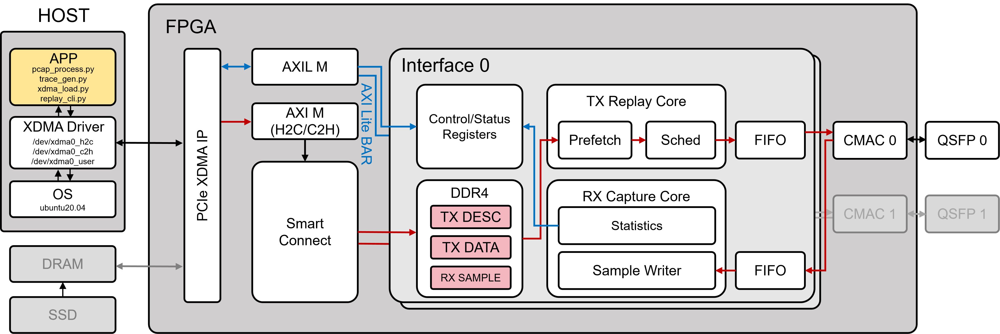

<div align="center">

# Tick Replayer

**基于 FPGA DDR 的 100G 流量回放原型，使用硬件 tick 调度包间隔。**

`FPGA` / `100G Ethernet` / `PCIe XDMA` / `DDR4` / `CMAC` / `PCAP Replay`

[English README](README.md)

</div>

> 2026-07-05 更新：四 DDR bank 版本已经完成上板验证并归档到
> `bitstreams/20260705_4ddr_localclock_timing_clean`。该版本映射 U200
> 四个 `16GiB` DDR 窗口，总计 `64GiB`，post-route WNS 为 `+0.002ns`。
> 详细测试记录见 `docs/evaluation_20260705_4ddr_localclock.md`。

## 项目概述

`Tick Replayer` 是面向 Xilinx Alveo U200 的 FPGA 流量回放原型。Linux 主机先
把 `pcap` 转换成包描述符和包载荷文件，再通过 `PCIe XDMA` 写入 FPGA `DDR4`，
随后通过 `AXI-Lite` 寄存器控制 FPGA 从 100G `CMAC` 端口按包间隔发出流量。

项目名里的 `Tick` 指硬件回放时钟 tick。`pcap` 中相邻包的时间戳差会被转换成
`gap_ticks`，FPGA 调度器用一个相对回放计数器决定每个包的释放时刻。因此这个项目
关注的不只是“把包发出去”，而是下面四个问题：

- 最大能回放多大的 `pcap` 或 trace。
- 最大能达到多少回放吞吐。
- 包间隔回放精度有多高。
- 主机侧软件工具如何完成转换、装载、控制和验证。

当前设计是双端口原型。`QSFP0` 和 `QSFP1` 各自有独立的 TX replay 通路，也各自有
轻量级 RX 统计和采样通路。因此一块 FPGA 可以同时在两个高速口收发，为后续模拟
双向 trace 的两端打基础。

## 目录

- [当前状态](#当前状态)
- [快速开始](#快速开始)
- [系统架构](#系统架构)
- [最大回放容量](#最大回放容量)
- [最大回放吞吐](#最大回放吞吐)
- [回放精度](#回放精度)
- [主机侧软件工具](#主机侧软件工具)
- [回放模式](#回放模式)
- [Trace 描述符格式](#trace-描述符格式)
- [构建和烧录](#构建和烧录)
- [验证命令](#验证命令)
- [仓库结构](#仓库结构)
- [当前限制](#当前限制)
- [后续计划](#后续计划)

## 当前状态

| 项目 | 状态 |
| --- | --- |
| 目标板卡 | Xilinx Alveo U200 |
| PCIe | Xilinx `XDMA`，Gen3 x16，memory-mapped `H2C`/`C2H` |
| Ethernet | 双 100G `CMAC`，连接 `QSFP0` 和 `QSFP1` |
| 控制面 | `XDMA` user `BAR` 到 `AXI-Lite` 寄存器 |
| Trace 存储 | 当前工程使用一个 U200 `DDR4` bank，地址窗口 `16GiB` |
| 回放模式 | `PRELOAD`、`LOOP`、`STREAM` ring buffer |
| RX 功能 | 包/字节/error 计数，最近包采样，SOP-to-SOP 间隔统计 |
| 时序归档 | `bitstreams/20260704_rxgap_precision_stream_loader_timing_clean` 记录 `WNS=+0.024 ns` |
| 全 64GB DDR | 计划中。当前公开 build 还没有启用 U200 四个 DDR bank |

## 快速开始

下面的命令展示如何把一份经典 `pcap` 文件从 `port 0` 回放出去。运行前默认已经完成
FPGA bitstream 烧录，Xilinx `XDMA` 驱动已经生成 `/dev/xdma0_*` 设备，并且对应
`QSFP` 链路已经连接。

先设置输入和输出路径：

```bash
export PCAP=/data/input.pcap
export TRACE_DIR=/tmp/tick_trace
export STREAM_DIR=/tmp/tick_stream
```

编译主机侧 C++ loader，并把 `pcap` 转成硬件 trace 格式：

```bash
make -C software

rm -rf "$TRACE_DIR" "$STREAM_DIR"
mkdir -p "$TRACE_DIR" "$STREAM_DIR"

python3 software/pcap2trace.py "$PCAP" \
  --out-dir "$TRACE_DIR" \
  --tick-hz 300000000
```

检查板卡和控制面是否可见：

```bash
lspci -nn -d 10ee:
ls -l /dev/xdma*
sudo python3 software/traffic_replay_cli.py --port 0 clear
sudo python3 software/traffic_replay_cli.py --port 0 status
```

真实光口回放时不要打开 `debug-force-link` 和 `debug-tx-ready`。只有在无光纤调试时，
才建议用 `debug-force-link on` 强制打开 TX gate；`debug-tx-ready on` 会让发送通路
直接 drain，不会真正把包打到线上。

### PRELOAD 回放

`PRELOAD` 模式先把完整 trace 复制到 FPGA `DDR4`，然后 FPGA 从 DDR 自主按时间戳
调度发包，回放过程中 host 不再参与 TX 数据路径。

```bash
sudo python3 software/xdma_load_trace.py \
  --port 0 \
  --manifest "$TRACE_DIR/manifest.json" \
  --desc-base 0x04000000 \
  --data-base 0x14000000 \
  --mode preload \
  --no-auto-drop

sudo python3 software/traffic_replay_cli.py --port 0 status
```

重新装载另一份 trace 前，先停止并清空回放核心：

```bash
sudo python3 software/traffic_replay_cli.py --port 0 stop
sudo python3 software/traffic_replay_cli.py --port 0 clear
```

### LOOP 回放

`LOOP` 模式重复使用同一份已经放在 DDR 中的 trace。下面的例子会把该 `pcap` 回放
`10` 次，并在每轮之间插入 `300000` 个 replay tick；在 `300MHz` 下这等于 `1ms`。

```bash
sudo python3 software/xdma_load_trace.py \
  --port 0 \
  --manifest "$TRACE_DIR/manifest.json" \
  --desc-base 0x04000000 \
  --data-base 0x14000000 \
  --mode loop \
  --loop-count 10 \
  --loop-gap 300000 \
  --no-auto-drop

sudo python3 software/traffic_replay_cli.py --port 0 status
```

### STREAM Ring 回放

`STREAM` ring 模式适合大于 FPGA DDR 预加载窗口的 trace。host 先把 `desc.bin` 和
`data.bin` 转成连续 stream record，再通过 `XDMA H2C` 持续填充 FPGA DDR 中的 ring。
只有完整 record 写入后，host 才推进 FPGA 可见的写指针；包间隔调度仍由 FPGA 完成。

```bash
python3 software/trace_to_stream.py \
  --manifest "$TRACE_DIR/manifest.json" \
  --out "$STREAM_DIR/stream.bin" \
  --out-manifest "$STREAM_DIR/stream_manifest.json"

sudo ./software/xdma_stream_ring_fast \
  --port 0 \
  --manifest "$STREAM_DIR/stream_manifest.json" \
  --ring-base 0x20000000 \
  --ring-size 0x08000000 \
  --prefill-bytes 0x04000000 \
  --batch-bytes 0x04000000 \
  --read-bytes 0x04000000 \
  --queue-depth 4 \
  --writer-threads 2 \
  --host-cache-bytes auto \
  --timeout 300

sudo python3 software/traffic_replay_cli.py --port 0 status
```

如果请求的回放速率高于当前动态装载安全速率，`status` 会出现 `late_packets` 或
`underrun_packets`。此时应增大包间隔、降低目标 `pcap` 带宽，或者改用 `PRELOAD`
模式获得最高吞吐。

### 端口和地址说明

上面的例子使用 `port 0` 和单 DDR bank 下安全的地址布局。四 DDR bank build 中，
`port 1` 通常把 TX 数据放在 bank 1：

```bash
# port 1 的 PRELOAD 或 LOOP
--port 1 --desc-base 0x0400000000 --data-base 0x0410000000

# port 1 的 STREAM ring
--port 1 --ring-base 0x0420000000 --ring-size 0x08000000
```

同一个 DDR bank 内不要让 `desc`、`data`、`STREAM` ring 或 RX sample 区域互相重叠。

## 系统架构



图中 `APP` 是主机侧 trace 生成、`XDMA` 装载和回放控制工具；`XDMA Driver` 是
Xilinx DMA Linux 驱动，暴露 `H2C`、`C2H` 和 user `BAR` 字符设备；`PCIe XDMA IP`
是 Xilinx PCI Express DMA endpoint；`AXIL M` 是访问控制/状态寄存器的
`AXI-Lite` master；`AXI M` 是访问 DDR 的 memory-mapped AXI master；`SmartConnect`
是 Xilinx AXI 互联和仲裁结构；`DDR4` 保存 TX 描述符、TX 载荷、STREAM ring 和
RX sample；`TX Replay Core` 包含描述符/载荷预取、时间戳调度和发包引擎；
`RX Capture Core` 负责接收统计、最近包采样和 SOP-to-SOP 间隔测量；`CMAC` 是
Xilinx 100G Ethernet MAC；`QSFP` 是 100G 光口。

`PRELOAD` 数据路径：

```text
pcap
  -> pcap2trace.py
  -> desc.bin + data.bin + manifest.json
  -> xdma_load_trace.py
  -> /dev/xdma0_h2c_0
  -> FPGA DDR4
  -> ddr_trace_reader
  -> replay_scheduler
  -> replay_tx_engine
  -> AXI-Stream FIFO
  -> CMAC TX
  -> QSFP
```

`STREAM` ring 数据路径：

```text
large pcap / stream file on host storage
  -> host loader 批量组织完整 stream record
  -> /dev/xdma0_h2c_0
  -> FPGA DDR4 ring
  -> host 写入完成后推进 STREAM_WR_PTR
  -> FPGA 消费 record 后推进 STREAM_RD_PTR
  -> host_stream_parser
  -> replay_scheduler
  -> CMAC TX
```

RX 侧默认不把所有包上传主机，而是维护计数器；需要时可以保存最近的截断包窗口，
并记录收到包之间的 SOP-to-SOP 间隔，用来验证回放精度。

## 最大回放容量

容量取决于回放模式。

### PRELOAD 容量

`PRELOAD` 要求整份 trace 在回放前完整放入 FPGA DDR。存入 DDR 的 trace 大小不等于
原始 `pcap` 大小。每个包占用：

```text
preload_trace_bytes_per_packet = 64 + align64(frame_len)
```

其中 `64` 是固定描述符大小，`align64(frame_len)` 是按 64 字节对齐后的包载荷空间。

当前工程使用一个 U200 `DDR4` bank，按 `16GiB` trace 空间估算：

| Frame bytes | 每包 trace bytes | `16GiB` DDR 可容纳包数 | 约等于原始 `pcap` 大小 |
| ---: | ---: | ---: | ---: |
| `64` | `128` | `134,217,728` | `10.00GiB` |
| `512` | `576` | `29,826,161` | `14.67GiB` |
| `1518` | `1600` | `10,737,418` | `15.34GiB` |
| `9000` | `9088` | `1,890,390` | `15.87GiB` |

如果后续启用 U200 四个 DDR bank，设计空间约为四倍：

| Frame bytes | `64GiB` DDR 可容纳包数 | 约等于原始 `pcap` 大小 |
| ---: | ---: | ---: |
| `64` | `536,870,912` | `40.00GiB` |
| `512` | `119,304,647` | `58.67GiB` |
| `1518` | `42,949,672` | `61.36GiB` |
| `9000` | `7,561,562` | `63.49GiB` |

### STREAM Ring 容量

`STREAM` ring 模式把 FPGA DDR 当滑动窗口，整份 trace 不必全部放入 FPGA DDR。因此
最大原始 `pcap` 大小主要受主机存储容量和主机侧转换/装载流水线限制。

以之前目标主机的存储预算为例：

| 存储条件 | 约可支持的最大原始 `pcap` |
| --- | ---: |
| 测试时剩余 SSD 空间 | `1.475TB` |
| 两块 2TB SSD 的原始设计空间 | `4.001TB` |

如果磁盘上还需要保存预转换后的 `stream.bin`，小包场景会因为每包 64 字节 stream
header 带来更明显的膨胀。

## 最大回放吞吐

吞吐需要区分两个口径：

- `wire throughput`：100G 物理链路上的占用，包含 FCS、preamble/SFD 和 IFG。
- `pcap/frame throughput`：trace 文件中可见的帧字节吞吐，通常不含 FCS、preamble/SFD 和 IFG。

100G 线速对应的原始 `pcap` 吞吐随包长变化：

| Frame bytes | 100G 线速对应 `pcap` 吞吐 | 包速率 |
| ---: | ---: | ---: |
| `64` | `72.73Gbps` | `142.05Mpps` |
| `512` | `95.52Gbps` | `23.32Mpps` |
| `1518` | `98.44Gbps` | `8.11Mpps` |
| `9000` | `99.73Gbps` | `1.39Mpps` |

当前 U200 光纤回环实测：

| 模式 | 测试项 | 结果 |
| --- | --- | ---: |
| `PRELOAD` | `64B`, `gap=3` | `70.4Gbps` wire，`51.2Gbps` frame/L2 |
| `PRELOAD` | `256B`, `gap=8` | `84.0Gbps` wire，`76.8Gbps` frame/L2 |
| `PRELOAD` | `512B`, `gap=14` | `91.9Gbps` wire，`87.8Gbps` frame/L2 |
| `PRELOAD` | `1518B`, `gap=38` | `97.4Gbps` wire，`95.9Gbps` frame/L2 |
| `PRELOAD` | mixed `64:3,1518:38` | `95.4Gbps` wire |
| `LOOP` | `1000` 包 x `10` loops | 计数正确，无 drop/stall/late/underrun |
| `STREAM` ring | `1518B`, `gap=300`, `1M` packets | 当前正确性优先测试约 `12.1Gbps` |
| raw `XDMA H2C` | host memory 写 FPGA DDR benchmark | 不同配置下观察到约 `69Gbps` 到 `83Gbps` |

`PRELOAD` 吞吐最高，因为回放过程中 host 不在发包数据路径里。`STREAM` ring 模式主要
用于更大 trace，但长期吞吐受 host SSD、host 内存搬运、`XDMA H2C`、DDR ring 写入和
FPGA DDR 读取共同限制。

## 回放精度

FPGA 回放调度器工作在 `300MHz` DDR/replay 时钟上，因此 tick 分辨率是：

```text
1 / 300MHz = 3.333ns
```

板上精度测试使用 RX 侧 `SOP-to-SOP` 测量。RX capture core 在 CMAC RX 时钟域里维护
自由运行计数器，每次收到一个包的 SOP 时计算：

```text
rx_gap_cycles = current_sop_tick - previous_sop_tick
```

主机软件再把这个 RX 实测间隔和原始 descriptor 里的 `gap_ticks` 换算到 ns 后逐项比较。
这个方法测的是端到端包间隔，包含 TX replay、CMAC TX、光纤回环和 CMAC RX，比只看
TX 调度器内部计数更接近真实现象。

当前 RX 侧精度套件结果：

| 测试项 | 目的 | 结果 |
| --- | --- | ---: |
| `uniform_128B_gap3000` | 固定 gap 基准 | 最大绝对误差 `10.38ns` |
| `mixed_gap_128B` | 混合 gap | 最大绝对误差 `12.61ns` |
| `small_packet_small_gap` | 64B 小包，`3/4/5/6/8` tick gap | 最大绝对误差 `8.05ns` |
| `mixed_size_legal` | 64B 到 1518B 大小包混合 | 最大绝对误差 `85.04ns` |
| `long_uniform_128B_gap3000` | `200000` 包长时漂移测试 | sample 窗口最大绝对误差 `14.45ns` |

RX gap sample ring 保存最近 `4096` 个包间隔。长 trace 的全部间隔都会参与
`count/sum/min/max/last` 统计，但逐项 CSV 读回只覆盖最近的 sample 窗口。

运行精度套件：

```bash
python3 software/replay_precision_suite.py \
  --tx-port 0 --rx-port 1 \
  --work-dir /tmp/precision_suite \
  --desc-base 0x04000000 \
  --data-base 0x14000000 \
  --timeout 180 \
  --report /tmp/precision_suite/report.md
```

## 主机侧软件工具

| 工具 | 用途 |
| --- | --- |
| `software/pcap2trace.py` | 把 classic `pcap` 转换成 `desc.bin`、`data.bin` 和 `manifest.json` |
| `software/gen_synthetic_trace.py` | 生成确定性 synthetic trace |
| `software/gen_synthetic_pcap.py` | 生成 synthetic `pcap` 输入 |
| `software/xdma_load_trace.py` | 把 `PRELOAD`/`LOOP` trace 装入 FPGA DDR，并配置 TX 寄存器 |
| `software/traffic_replay_cli.py` | 通过 `/dev/xdma0_user` 读写控制/状态寄存器 |
| `software/ddr_readback_check.py` | 验证 `XDMA H2C` 和 `C2H` 访问 FPGA DDR |
| `software/preload_stress_test.py` | 生成并回放固定包长 preload 压力测试 |
| `software/preload_mixed_test.py` | 生成并回放大小包混合 preload 测试 |
| `software/loopback_rx_verify.py` | 通过光纤回环检查 TX 到 RX 的 payload sample |
| `software/replay_precision_suite.py` | 运行 RX 侧回放精度测试 |
| `software/xdma_stream_ring_fast.cpp` | C++ `STREAM` ring loader，使用批量 H2C 写 |
| `software/stream_stress_test.py` | 生成并运行 `STREAM` ring 压力测试 |

构建 C++ loader：

```bash
cd software
make
```

转换 pcap：

```bash
python3 software/pcap2trace.py input.pcap \
  --out-dir /tmp/trace_out \
  --tick-hz 300000000
```

装载并启动 preload 回放：

```bash
sudo python3 software/xdma_load_trace.py \
  --port 0 \
  --manifest /tmp/trace_out/manifest.json \
  --desc-base 0x04000000 \
  --data-base 0x14000000 \
  --mode preload
```

查看状态：

```bash
sudo python3 software/traffic_replay_cli.py --port 0 status
sudo python3 software/traffic_replay_cli.py --port 0 regs
sudo python3 software/traffic_replay_cli.py --port 1 rx-status
```

## 回放模式

### PRELOAD

host 在回放前把完整 `desc.bin` 和 `data.bin` 写入 FPGA DDR。回放过程中 FPGA 从 DDR
读取所有描述符和载荷，host 不再参与发包数据路径。

适合：

- 最大吞吐测试。
- 最稳定的时间调度。
- 可重复 benchmark 和精度测试。

限制：

- 最大 trace 大小受 FPGA DDR 空间限制。

### LOOP

`LOOP` 模式重复使用同一份 DDR 中的 trace，适合长时间压力测试，避免反复从 host 装载。

### STREAM Ring

`STREAM` ring 模式在 FPGA DDR 中维护一个有界 ring。host 写入完整 stream record 后推进
`STREAM_WR_PTR`，FPGA 消费 record 后推进 `STREAM_RD_PTR`。

适合：

- 大于 FPGA DDR preload 窗口的大 trace。
- 后续 SSD -> host memory -> FPGA DDR 的动态装载回放。

限制：

- 持续吞吐受动态装载路径限制。
- 当前正确性优先实现已经可用，但还没有达到 100G 持续回放。

## Trace 描述符格式

`PRELOAD` 和 `LOOP` 使用两个二进制文件：

- `desc.bin`：每个包一个 64 字节 descriptor。
- `data.bin`：包载荷，按 64 字节 AXI beat 对齐。

每个 descriptor 是小端格式，正好一个 512-bit AXI beat：

| Byte offset | 字段 | 宽度 | 含义 |
| ---: | --- | ---: | --- |
| `0x00` | `gap_ticks` | 64 bits | 相对上一个包的间隔，单位是 replay clock tick |
| `0x08` | `data_word_offset` | 32 bits | 从 `DATA_BASE` 开始的载荷偏移，单位是 64 字节 word |
| `0x0c` | `frame_len` | 16 bits | Ethernet frame 长度，不含 preamble 和 FCS |
| `0x0e` | `flags` | 16 bits | 预留给未来 per-packet 控制 |
| `0x10` | reserved | 48 bytes | 保留，当前应写 0 |

更完整的寄存器表和 preload 实现细节见 [docs/preload.md](docs/preload.md)。

## 构建和烧录

仓库以源码为中心，Vivado 工程由 Tcl 生成。

环境要求：

- Linux host。
- Vivado 2020.2。
- Xilinx Alveo U200。
- Xilinx `XDMA` Linux driver。
- Python 3。
- `g++` 和 `make`。

构建双端口 bitstream：

```bash
TRAFFIC_REPLAY_PORT_COUNT=2 \
TRAFFIC_REPLAY_HW_BUILD_ROOT=$PWD/build_hw \
vivado -mode batch -source scripts/build_hw_bitstream.tcl
```

构建单端口调试 bitstream：

```bash
TRAFFIC_REPLAY_PORT_COUNT=1 \
TRAFFIC_REPLAY_HW_BUILD_ROOT=$PWD/build_hw_oneport \
vivado -mode batch -source scripts/build_hw_bitstream.tcl
```

通过 Vivado hardware server 烧录：

```bash
vivado -mode batch -source scripts/program_remote.tcl \
  -tclargs build_hw/vivado_hw/traffic_replay_hw.runs/impl_1/traffic_replay_bd_wrapper.bit
```

重新烧录 PCIe endpoint 后，检查设备是否枚举：

```bash
lspci -nn -d 10ee:
ls -l /dev/xdma*
```

## 验证命令

控制面检查：

```bash
sudo python3 software/traffic_replay_cli.py --port 0 clear
sudo python3 software/traffic_replay_cli.py --port 0 status
sudo python3 software/traffic_replay_cli.py --port 1 status
```

DDR H2C/C2H 读回校验：

```bash
sudo python3 software/ddr_readback_check.py \
  --case 0x00000000:4096 \
  --case 0x00100000:65536 \
  --case 0x08000000:1048576 \
  --repeat 2
```

preload 吞吐测试：

```bash
sudo python3 software/preload_stress_test.py \
  --port 0 \
  --packet-count 100000 \
  --case 64:3 \
  --case 256:8 \
  --case 512:14 \
  --case 1518:38 \
  --desc-base 0x04000000 \
  --data-base 0x14000000 \
  --require-no-drop
```

光纤回环 payload 验证：

```bash
sudo python3 software/loopback_rx_verify.py \
  --tx-port 0 \
  --rx-port 1 \
  --desc-base 0x1c000000 \
  --data-base 0x4c000000 \
  --rx-ring-base 0x70000000 \
  --rx-ring-size 0x01000000 \
  --truncate-bytes 128 \
  --packet-count 64 \
  --frame-len 128 \
  --gap-ticks 3000
```

stream ring 压力测试：

```bash
python3 software/stream_stress_test.py \
  --port 0 \
  --frame-sizes 1518 \
  --packet-count 1000000 \
  --gap-ticks 300 \
  --ring-base 0x50000000 \
  --ring-size 0x20000000 \
  --prefill-bytes 0x10000000 \
  --batch-bytes 0x08000000 \
  --read-bytes 0x08000000 \
  --queue-depth 4 \
  --loader cpp
```

## 仓库结构

```text
rtl/           可综合 RTL
constraints/   板卡和时序约束
scripts/       Vivado 工程生成、构建、烧录 Tcl 脚本
software/      Linux 主机侧工具和 loader
sim/           仿真 testbench
docs/          设计说明和评估报告
docs/images/   架构图和结果图
bitstreams/    带说明的重要 bitstream 归档
reports/       部分验证报告
```

## 当前限制

- 当前公开硬件 build 使用一个 U200 DDR bank，还没有启用全部四个 DDR bank，也就是还没有完整使用 `64GB`。
- `STREAM` ring 模式可用，但当前正确性优先 loader 还不能持续 100G 回放。
- RX interval sample 只保存最近 `4096` 个间隔。长 trace 有完整聚合统计，但没有完整逐包 timestamp 日志。
- RX 侧端到端精度包含 scheduler、TX buffering、CMAC framing、光纤回环、RX CMAC 和 RX 采样量化；大小包混合场景的局部误差会比固定包长更大。
- 双端口同时接近 100G 大包回放时，当前单 DDR bank 共享路径会成为瓶颈。

## 后续计划

- 启用 U200 四个 DDR bank，扩大 trace 空间。
- 优化 `STREAM` 模式，提升动态装载和持续回放吞吐。
- 增强 DDR 预取并行度，改善双端口高负载能力。
- 增加靠近 `CMAC` 的可选 egress-side scheduler，降低大小包混合场景的端到端 SOP 抖动。
- 将 RX event logging 从最近 gap sample 扩展为更大的 timestamp/event ring。
- 持续归档重要 bitstream，并记录源码 commit、时序、资源和板上验证结果。
