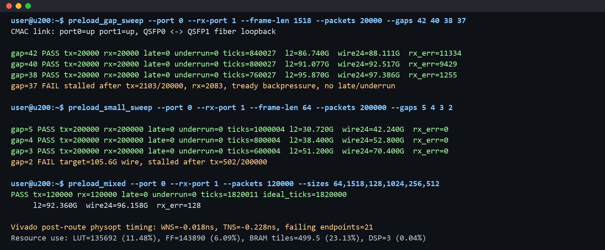

# Preload Mode Architecture and Validation

This note describes the current `PRELOAD` mode in Tick Replayer.  It documents
the hardware/software contract, the BAR register map, the datapath optimizations
that were added for high-rate replay, the July 1, 2026 U200 loopback results,
and the remaining issues that must be fixed before this build can be called a
clean 100G replay image.

## Scope

`PRELOAD` mode assumes that the host has already converted a trace into:

* `desc.bin`: one 64-byte descriptor per packet.
* `data.bin`: packet payloads, padded and addressed as 64-byte words.
* `manifest.json`: packet count, byte count, descriptor path, and data path.

The host writes `desc.bin` and `data.bin` into FPGA `DDR4` through
memory-mapped `XDMA H2C`, programs the `AXI-Lite` BAR registers, and starts the
FPGA replay core.  During replay, the FPGA reads all descriptors and payloads
from `DDR4`; the host is no longer in the transmit datapath.

The current U200 test setup connects `QSFP0` and `QSFP1` with a 100G optical
loopback fiber.  The representative tests below transmit from port 0 and count
packets on port 1.

## Hardware Datapath

```text
Host trace files
  -> XDMA H2C memory-mapped writes
  -> FPGA DDR4 descriptor/data regions
  -> ddr_trace_reader
  -> replay_scheduler
  -> replay_tx_engine
  -> AXI-Stream async FIFO
  -> axis_to_lbus_512
  -> CMAC TX
  -> QSFP optical loopback
  -> CMAC RX
  -> lbus_to_axis_512
  -> rx_capture_core counters / optional DDR sample ring
```

The `PRELOAD` source is `ddr_trace_reader`.  It reads descriptors from DDR,
scans payload locality, coalesces adjacent payload reads, and feeds packet
metadata plus 512-bit payload beats into the common scheduler/TX engine.

The `STREAM` source and host streaming parser still exist, but they are bypassed
when `MODE=PRELOAD`.

## Descriptor Format

Each packet descriptor is exactly 64 bytes and is little-endian:

| Byte offset | Width | Field | Meaning |
| ---: | ---: | --- | --- |
| `0x00` | 64 bits | `gap_ticks` | Packet release gap relative to the previous packet.  The host precomputes this value in replay clock ticks. |
| `0x08` | 32 bits | `word_offset` | Payload offset in 64-byte words from `DATA_BASE`. |
| `0x0c` | 16 bits | `frame_len` | Ethernet frame length in bytes, excluding preamble and FCS. |
| `0x0e` | 16 bits | `flags` | Reserved for per-packet control.  Current tests use `0`. |
| `0x10` | 48 bytes | reserved | Must be written as `0` for forward compatibility. |

The 64-byte descriptor size is intentionally kept even for small packets.  It is
simple to parse, aligned for DDR bursts, and leaves room for future metadata
without changing the host/FPGA contract.

## BAR Map

The XDMA user BAR exposes four 64 KiB windows:

| BAR offset | Window |
| ---: | --- |
| `0x00000` | `TX0` replay control/status |
| `0x10000` | `TX1` replay control/status |
| `0x20000` | `RX0` capture/stat control |
| `0x30000` | `RX1` capture/stat control |

The build also routes a DDR controller control aperture after these windows.
Software normally accesses only the replay and capture windows.

### TX Replay Registers

Offsets below are relative to each `TX` window.

| Offset | Register | Access | Description |
| ---: | --- | --- | --- |
| `0x0000` | `CONTROL` | RW pulse/state | bit 0 `start`, bit 1 `stop`, bit 2 `clear`, bit 3 `pause`. |
| `0x0004` | `MODE` | RW | `0=PRELOAD`, `1=STREAM`, `2=LOOP`. |
| `0x0008` | `STATUS` | RO | bit 0 `running`, bit 1 `done`, bit 2 `late`, bit 3 `underrun`, bit 4 raw CMAC link, bit 5 effective TX gate. |
| `0x0010` | `DESC_BASE_LO` | RW | Descriptor base address low word. |
| `0x0014` | `DESC_BASE_HI` | RW | Descriptor base address high word. |
| `0x0018` | `DATA_BASE_LO` | RW | Payload base address low word. |
| `0x001c` | `DATA_BASE_HI` | RW | Payload base address high word. |
| `0x0020` | `TRACE_LO` | RW | Trace byte count low word.  Used by stream-buffer mode. |
| `0x0024` | `TRACE_HI` | RW | Trace byte count high word. |
| `0x0028` | `PKT_LO` | RW | Packet count low word. |
| `0x002c` | `PKT_HI` | RW | Packet count high word. |
| `0x0030` | `LOOP_LO` | RW | Loop count low word. |
| `0x0034` | `LOOP_HI` | RW | Loop count high word. |
| `0x0038` | `LOOP_GAP_LO` | RW | Gap between replay loops, low word. |
| `0x003c` | `LOOP_GAP_HI` | RW | Gap between replay loops, high word. |
| `0x0040` | `START_LO` | RW | Reserved start-time low word.  Current scheduler uses a replay-relative baseline on `start`. |
| `0x0044` | `START_HI` | RW | Reserved start-time high word. |
| `0x0048` | `RATE` | RW | Reserved Q16.16 rate field.  Current preload tests use descriptor gaps directly. |
| `0x004c` | `WATERMARK` | RW | Stream prefetch watermark. |
| `0x0050` | `FIFO_LEVEL` | RO | Internal stream FIFO level. |
| `0x0054` | `DEBUG_CTRL` | RW | bit 0 `force_link_up`, bit 1 `force_tx_ready`.  These are debug-only controls. |
| `0x0060` | `TX_PKTS_LO` | RO | Transmitted packet count low word. |
| `0x0064` | `TX_PKTS_HI` | RO | Transmitted packet count high word. |
| `0x0068` | `TX_BYTES_LO` | RO | Transmitted frame byte count low word. |
| `0x006c` | `TX_BYTES_HI` | RO | Transmitted frame byte count high word. |
| `0x0070` | `LATE_LO` | RO | Late packet count low word. |
| `0x0074` | `LATE_HI` | RO | Late packet count high word. |
| `0x0078` | `UNDERRUN_LO` | RO | Payload underrun count low word. |
| `0x007c` | `UNDERRUN_HI` | RO | Payload underrun count high word. |
| `0x0080` | `DEBUG_STATUS` | RO | Replay source, scheduler, and TX ready status bits. |
| `0x0084` | `DEBUG_AXI` | RO | AXI read-channel debug bits. |
| `0x0088` | `DEBUG_AR_LO` | RO | Last/active AXI read address low word. |
| `0x008c` | `DEBUG_AR_HI` | RO | Last/active AXI read address high word. |
| `0x0090` | `DEBUG_RDATA` | RO | Low 32 bits of observed AXI read data. |
| `0x0094` | `DEBUG_TICK_LO` | RO | Replay-relative hardware tick counter low word. |
| `0x0098` | `DEBUG_TICK_HI` | RO | Replay-relative hardware tick counter high word. |
| `0x00a0` | `STREAM_WR_LO` | RW | Host-committed stream write count low word. |
| `0x00a4` | `STREAM_WR_HI` | RW | Host-committed stream write count high word. |
| `0x00a8` | `STREAM_RD_LO` | RO | FPGA-consumed stream read count low word. |
| `0x00ac` | `STREAM_RD_HI` | RO | FPGA-consumed stream read count high word. |
| `0x00b0` | `STREAM_RING_LO` | RW | Stream ring size low word. |
| `0x00b4` | `STREAM_RING_HI` | RW | Stream ring size high word. |
| `0x00b8` | `STREAM_CTRL` | RW | bit 0 `stream_eof`. |
| `0x00bc` | `STREAM_STATUS` | RO | Stream reader status/debug bits. |
| `0x00c0` | `STREAM_LEVEL_LO` | RO | Stream ring fill level low word. |
| `0x00c4` | `STREAM_LEVEL_HI` | RO | Stream ring fill level high word. |

The current `DEBUG_STATUS` bit assignment is:

| Bit | Meaning |
| ---: | --- |
| `3:0` | Active reader state. |
| `4` | `sel_stream_mode`. |
| `5` | `sel_ddr_mode`. |
| `6` | `pause`. |
| `7` | `core_enable`. |
| `8` | Source busy. |
| `9` | Source done. |
| `10` | Source error. |
| `11` | DDR metadata valid. |
| `12` | DDR metadata ready. |
| `13` | DDR payload AXIS valid. |
| `14` | DDR payload AXIS ready. |
| `15` | Scheduled packet valid. |
| `16` | Scheduled packet ready. |
| `17` | Source AXIS valid. |
| `18` | Source AXIS ready. |
| `19` | TX AXIS valid toward the downstream FIFO/CMAC path. |
| `20` | TX AXIS ready from the downstream FIFO/CMAC path. |
| `21` | DDR reader start pulse. |
| `22` | `force_tx_ready` debug override. |

In the July 1 over-rate tests, stalls were diagnosed by this register: the
replay core had payload and valid TX data, but bit 20 (`m_tx_axis_tready`) was
low, meaning the downstream TX FIFO/CMAC side was backpressuring the replay
core.

### RX Capture Registers

Offsets below are relative to each `RX` window.

| Offset | Register | Access | Description |
| ---: | --- | --- | --- |
| `0x0000` | `CONTROL` | RW | bit 0 `enable`, bit 1 stats clear pulse, bit 2 `capture_enable`. |
| `0x0004` | `STATUS` | RO | Link, FIFO, writer-state, and overflow debug bits. |
| `0x0010` | `RING_BASE_LO` | RW | DDR sample ring base low word. |
| `0x0014` | `RING_BASE_HI` | RW | DDR sample ring base high word. |
| `0x0018` | `RING_SIZE` | RW | DDR sample ring size in bytes. |
| `0x001c` | `TRUNC_BYTES` | RW | Maximum bytes captured per packet.  Default is `256`. |
| `0x0020` | `WRITE_PTR` | RW/RO | Current sample-ring write pointer. |
| `0x0030` | `RX_PKTS_LO` | RO | Received packet count low word. |
| `0x0034` | `RX_PKTS_HI` | RO | Received packet count high word. |
| `0x0038` | `RX_BYTES_LO` | RO | Received byte count low word. |
| `0x003c` | `RX_BYTES_HI` | RO | Received byte count high word. |
| `0x0040` | `RX_ERRS_LO` | RO | Receive error count low word. |
| `0x0044` | `RX_ERRS_HI` | RO | Receive error count high word. |
| `0x0048` | `CAP_BYTES_LO` | RO | Captured sample bytes low word. |
| `0x004c` | `CAP_BYTES_HI` | RO | Captured sample bytes high word. |
| `0x0050` | `AXI_WR_LO` | RO | DDR sample-ring AXI write count low word. |
| `0x0054` | `AXI_WR_HI` | RO | DDR sample-ring AXI write count high word. |
| `0x0058` | `AXI_ERR_LO` | RO | DDR sample-ring AXI write error count low word. |
| `0x005c` | `AXI_ERR_HI` | RO | DDR sample-ring AXI write error count high word. |
| `0x0060` | `DEBUG` | RO | Capture writer debug state. |

## Host Software Flow

The preload software stack is intentionally small:

1. `pcap2trace.py` or `gen_synthetic_trace.py` creates `desc.bin`,
   `data.bin`, and `manifest.json`.
2. `xdma_load_trace.py` writes descriptors and payloads through
   `/dev/xdma0_h2c_0`, then programs the selected TX BAR window.
3. `traffic_replay_cli.py` provides `start`, `stop`, `clear`, `status`,
   `regs`, `debug-tx-ready`, and per-port access.
4. `ddr_readback_check.py` verifies basic host-to-DDR and DDR-to-host access
   through `/dev/xdma0_h2c_0` and `/dev/xdma0_c2h_0`.
5. `hw_validation_suite.py` remains the common smoke/stress wrapper, while the
   July 1 tests used focused preload sweep scripts to isolate scheduler and TX
   datapath behavior.

The host must only use `force_link_up` and `force_tx_ready` for bring-up.  Final
throughput or precision numbers must be collected with a real CMAC link and
without forcing downstream readiness.

## Datapath Optimizations Added

The latest preload work focused on reducing bubbles between DDR, scheduler, and
CMAC:

* `ddr_trace_reader` now keeps descriptor, metadata, plan, payload-command, AXI
  command, and payload FIFOs.  The payload FIFO depth is `4096` 512-bit beats.
* Payload read coalescing can group adjacent packet payloads into a larger DDR
  run.  The current coalescing window is up to `255` packets and up to `256`
  AXI beats per burst.
* Descriptor scanning starts before the whole trace is consumed; it uses a
  descriptor FIFO and reserved payload-space accounting to avoid overflowing the
  payload FIFO.
* AXI response classification was moved into explicit command-head registers.
  This removes ambiguous direct dependence on FIFO memory at the response head
  and made completion/error accounting more deterministic.
* `replay_scheduler` now has a one-cycle metadata staging register before the
  scheduling FIFO.  This breaks the timing path from incoming metadata through
  target-tick calculation into block RAM writes while keeping one-packet-per-
  cycle steady-state acceptance.
* The scheduler resets its replay-relative tick baseline on `start` and `clear`,
  so long FPGA uptime no longer affects new trace timing.
* `axis_sync_fifo` and `axis_async_fifo` use XPM block RAM with always-enabled
  memory ports to shorten count/ready-to-BRAM-enable paths.
* `axis_to_lbus_512` now uses local synchronized reset in the CMAC transmit
  clock domain to reduce high-fanout reset timing pressure.

The design still does not implement the full future target of many independent
outstanding DDR reads with separate descriptor and payload AXI channels.  It has
deeper queues and stronger coalescing, but the next preload performance step is
to further pipeline `PL_SCAN`/`PL_AR`, allow more read requests to remain in
flight, and decouple descriptor fetch from payload fetch more aggressively.

## Timing and Resource Status

This experimental dual-port bitstream was built on the remote U200 host with
Vivado 2020.2.  Bit generation completed, but post-route timing is not clean:

| Metric | Value |
| --- | ---: |
| `WNS` | `-0.018 ns` |
| `TNS` | `-0.228 ns` |
| Failing setup endpoints | `21` |
| Hold slack | `0.001 ns` |

Placed utilization:

| Resource | Used | Available | Utilization |
| --- | ---: | ---: | ---: |
| `CLB LUTs` | `135692` | `1182240` | `11.48%` |
| `CLB Registers` | `143890` | `2364480` | `6.09%` |
| `Block RAM Tile` | `499.5` | `2160` | `23.13%` |
| `URAM` | `0` | `960` | `0.00%` |
| `DSPs` | `3` | `6840` | `0.04%` |

The resource profile shows that the design is spending BRAM to buy buffering
and timing isolation.  This is intentional for replay accuracy: the host can
pay the preload cost before replay, while the FPGA must avoid starvation during
the timed transmit window.

## Validation Summary

Archived evidence:

* Bitstream archive:
  `bitstreams/20260701_203500_dual_preload_gap38_mixed_timing_violation/`
* Screenshot-style result summary:
  `docs/images/preload_20260701_terminal.png`



### 1518-Byte Packet Sweep

`20000` packets, port 0 TX to port 1 RX:

| Gap ticks | Result | TX packets | RX packets | Late | Underrun | TX L2 Gbps | Wire-est. Gbps | RX errors |
| ---: | --- | ---: | ---: | ---: | ---: | ---: | ---: | ---: |
| `42` | pass | `20000` | `20000` | `0` | `0` | `86.740` | `88.111` | `11334` |
| `40` | pass | `20000` | `20000` | `0` | `0` | `91.077` | `92.517` | `9429` |
| `38` | pass | `20000` | `20000` | `0` | `0` | `95.870` | `97.386` | `1255` |
| `37` | fail | `2103` | `2083` | `0` | `0` | timeout | timeout | `4` |

Interpretation: `gap=38` is the best currently observed large-packet physical
loopback point.  It is close to the 100G target and the scheduler does not
report `late` or `underrun`.  `gap=37` requests slightly above the 100G physical
limit for this packet size and stalls when the downstream TX path backpressures
the replay core.

### 64-Byte Packet Sweep

`200000` packets, port 0 TX to port 1 RX:

| Gap ticks | Result | TX packets | RX packets | Late | Underrun | TX L2 Gbps | Wire-est. Gbps | RX errors |
| ---: | --- | ---: | ---: | ---: | ---: | ---: | ---: | ---: |
| `5` | pass | `200000` | `200000` | `0` | `0` | `30.720` | `42.240` | `0` |
| `4` | pass | `200000` | `200000` | `0` | `0` | `38.400` | `52.800` | `0` |
| `3` | pass | `200000` | `200000` | `0` | `0` | `51.200` | `70.400` | `0` |
| `2` | fail | `502` | invalid after stall | `0` | `0` | timeout | timeout | invalid |

Interpretation: the current timestamp scheduler releases at most one packet per
300 MHz replay tick.  For 64-byte packets, `gap=2` corresponds to about
`105.6Gbps` wire rate including 20-byte preamble/IFG plus 4-byte FCS estimate,
so it overdrives the physical path.  The next integer gap is `3`, which is only
about `70.4Gbps`.  Reaching 100G for minimum-size packets while keeping precise
timestamps needs an architectural change such as a fractional/NCO scheduler,
multi-packet-per-tick release, or LBUS packing that can represent the 2/3 tick
average spacing needed by 148.8 Mpps traffic.

### Mixed Packet Test

`120000` packets with equal counts of `64`, `1518`, `128`, `1024`, `256`, and
`512` byte frames:

| Metric | Value |
| --- | ---: |
| TX packets | `120000` |
| RX packets | `120000` |
| TX bytes | `70040000` |
| Ideal ticks | `1820000` |
| Measured ticks | `1820011` |
| Late packets | `0` |
| Underrun packets | `0` |
| TX L2 Gbps | `92.360` |
| Wire-est. Gbps | `96.158` |
| RX errors | `128` |

Interpretation: the scheduler is behaving well for a mixed packet trace; the
measured duration differs from the ideal schedule by only `11` ticks.  The data
path completes packet-count loopback, but the nonzero RX error count means the
receive adapter/capture side still needs cleanup before this can be treated as a
full data-integrity pass.

## Major Remaining Preload Issues

* Timing is still slightly negative (`WNS=-0.018 ns`), so the archived image is
  experimental.
* Large-packet and mixed-packet loopback runs preserve packet count, but RX error
  counters are not zero and RX byte counts can differ from TX bytes.  The likely
  area is the `CMAC` RX LBUS-to-AXIS adapter or the RX capture interpretation of
  `mty`, `eop`, and error signals.
* Over-rate tests can leave the TX async FIFO/CMAC side backpressured.  Normal
  `stop`/`clear` resets the replay core state but does not yet provide a strong
  per-port soft reset for the whole TX datapath.  Reprogramming recovers the
  path; the next RTL fix should add a BAR-controlled datapath reset.
* 64-byte packets cannot reach 100G with the current integer `gap_ticks` and
  one-packet-per-tick scheduler.  `gap=2` overdrives the link; `gap=3` is stable
  but only about `70.4Gbps` wire estimate.
* The DDR reader has deeper queues and burst coalescing, but it is not yet the
  final multi-outstanding, dual-channel descriptor/payload architecture.
* `force_tx_ready` is diagnostic only.  It can drain internal replay counters
  while bypassing real downstream readiness, so it must not be used for physical
  throughput results.

## Next Work

1. Add a BAR-controlled per-port datapath reset covering `ddr_trace_reader`,
   scheduler, TX engine, async FIFO, AXIS-to-LBUS adapter, and CMAC-side local
   state.
2. Fix and verify the RX LBUS-to-AXIS/capture path until packet count, byte
   count, and RX error counters are all clean for 64B, 1518B, and mixed traces.
3. Close timing with positive WNS in the dual-port build, then repeat the same
   sweep.
4. For large packets, continue reducing `PL_SCAN` and `PL_AR` bubbles and add
   more true outstanding DDR reads.
5. For minimum-size packets, decide whether to keep the current descriptor
   scheduler and accept the `70.4Gbps` stable point, or add multi-packet/fractional
   scheduling to target 100G line rate.
