# Tick_Replayer 板上评估报告

本文记录 `20260702_113125_dual_preload_autodrop_wns_minus003_accepted` 版本 bitstream 的板上测试结果。测试目标是验证 `XDMA H2C/C2H`、`FPGA DDR`、`PRELOAD` 回放、双端口 TX、低速 TX/RX 回环、`gap=0` 鲁棒性、15 分钟压力稳定性，以及当前控制面寄存器可观测性。

## 1. 测试对象

| 项目 | 内容 |
| --- | --- |
| 远程主机 | `FNIL-2022DEC-GPU-3` |
| FPGA 板卡 | Xilinx Alveo U200 |
| PCIe | Gen3 x16，`lspci` 枚举为 `10ee:903f` |
| XDMA 设备 | `/dev/xdma0_h2c_0`、`/dev/xdma0_c2h_0`、`/dev/xdma0_user` |
| bitstream | `/home/user/traffic_replay_remote_src/bitstreams/20260702_113125_dual_preload_autodrop_wns_minus003_accepted/traffic_replay_bd_wrapper.bit` |
| Vivado timing | bitgen 成功，0 errors；接受的 post-route phys_opt timing 为 `WNS=-0.003 ns`、`TNS=-0.027 ns` |
| 注意事项 | CMAC AN/LT license 在 Vivado 2020.2 中报告 evaluation/design_linking critical warning |

原始日志保存于：

```text
docs/evaluation_assets/20260702_robust_autodrop/logs/
```

真实终端命令行截图保存于：

```text
docs/evaluation_assets/20260702_robust_autodrop/screenshots/
```

## 2. 测试结论总览

| 测试项 | 结果 | 关键现象 |
| --- | --- | --- |
| PCIe/XDMA 枚举 | 通过 | `lspci`、`/dev/xdma*` 正常，BAR 可读 |
| 控制平面 | 通过 | `status/regs/auto-drop` 可正常读写 |
| H2C/C2H DDR 回读 | 通过 | 多地址、多大小 deterministic pattern 全部读回一致 |
| PRELOAD 小包 | 通过 | `64B gap=3`，双端口均 `drop=0 late=0 underrun=0 stall=0`，约 `70.398Gbps wire` |
| PRELOAD 大包 | 通过 | `1518B gap=38`，双端口均 `drop=0 late=0 underrun=0 stall=0`，约 `97.388Gbps wire` |
| PRELOAD mixed | 通过 | `64B gap=3` 与 `1518B gap=38` 交错，`100000` 包，约 `95.413Gbps wire` |
| 调度 tick 精度 | 通过 | `50000` mixed 包，`expected_ticks=1025000`，`debug_ticks=1025027`，误差 `27 ticks` |
| TX/RX 低速回环内容 | 通过 | `64B` 包双向回环，RX sample ring 读回 payload 匹配，`rx_errors=0` |
| TX/RX 较快/多 beat 回环 | 部分通过 | `128B gap=2000` payload 匹配，但 `rx_errors` 非零；本轮真实终端复跑为 `rx_errors=4`，需要继续查 RX adapter/error 语义 |
| `gap=0` 鲁棒性 | 通过鲁棒性，不通过无损回放 | 系统能结束且计数 drop/stall，不会死机；这是过载保护，不是正确回放速率 |
| 15 分钟压力测试 | 通过 | `900.186s`、`472` 轮、`0` 失败，双端口交替 mixed no-drop |

## 3. 控制平面与枚举

测试命令：

```bash
lspci -nn -d 10ee:
ls -l /dev/xdma*
python3 software/traffic_replay_cli.py --port 0 status
python3 software/traffic_replay_cli.py --port 0 regs
python3 software/traffic_replay_cli.py --port 0 auto-drop off
python3 software/traffic_replay_cli.py --port 0 auto-drop on
```

关键控制寄存器：

| 寄存器 | 含义 |
| --- | --- |
| `CONTROL` | `start/stop/clear/pause/resume` 控制 |
| `MODE` | 当前回放模式，`0=preload`、`1=stream`、`2=loop` |
| `STATUS` | `running/done/late/underrun/link/gate` 状态 |
| `DEBUG_CTRL` | bit0 `force_link_up`，bit1 `force_tx_ready`，bit2 `auto_tx_drop` |
| `DROP_PKTS/DROP_BEATS/STALL_EVT` | 自动丢弃和 stall watchdog 计数 |
| `DEBUG_STATUS` | replay core 内部状态，包括 `m_tx_axis_tready/tvalid` 等 |

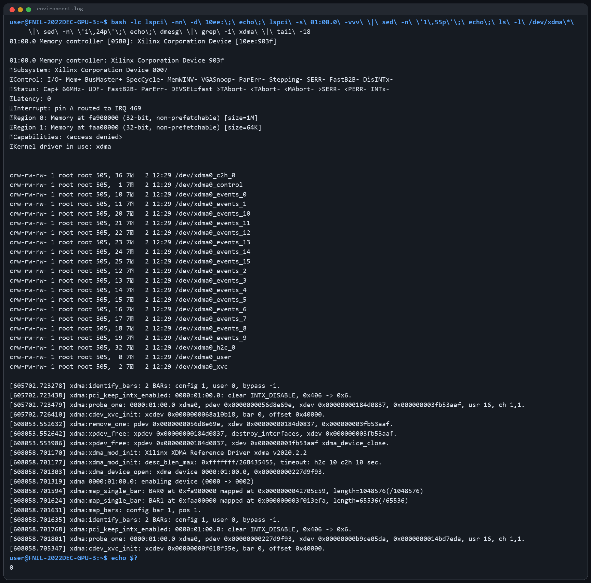

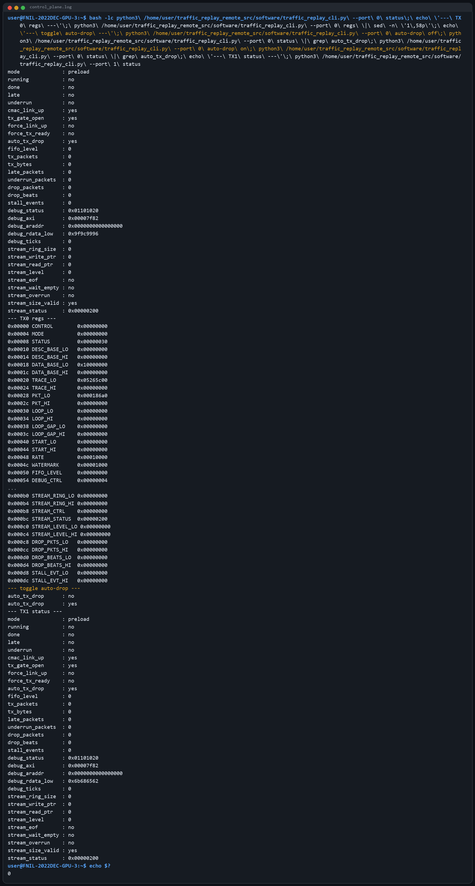

## 4. H2C/C2H DDR 读回校验

测试命令：

```bash
python3 software/ddr_readback_check.py \
  --repeat 2 \
  --case 0x00000000:0x1000 \
  --case 0x00100000:0x10000 \
  --case 0x10000000:0x100000 \
  --case 0x18000000:0x800000
```

结论：所有 deterministic pattern 均通过 H2C 写入 FPGA DDR 后由 C2H 读回一致。这个测试证明了：

- Host 到 FPGA DDR 的 XDMA H2C 路径可用。
- FPGA DDR 到 Host 的 XDMA C2H 路径可用。
- 多地址范围读写没有发现错位或数据损坏。

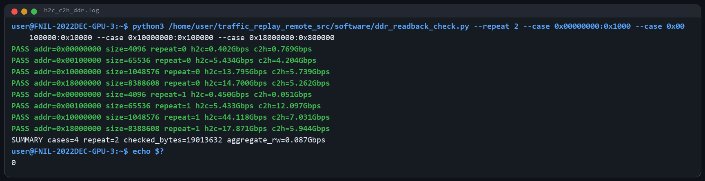

## 5. PRELOAD 大包/小包回放

测试命令：

```bash
python3 software/preload_stress_test.py \
  --port 0 \
  --packet-count 50000 \
  --case 64:3 \
  --case 1518:38 \
  --require-no-drop

python3 software/preload_stress_test.py \
  --port 1 \
  --packet-count 50000 \
  --case 64:3 \
  --case 1518:38 \
  --require-no-drop
```

结果：

| 端口 | 包长/gap | 结果 | L2 吞吐 | wire 吞吐 |
| --- | --- | --- | --- | --- |
| port0 | `64B gap=3` | `drop=0 late=0 underrun=0 stall=0` | `51.199Gbps` | `70.398Gbps` |
| port0 | `1518B gap=38` | `drop=0 late=0 underrun=0 stall=0` | `95.872Gbps` | `97.388Gbps` |
| port1 | `64B gap=3` | `drop=0 late=0 underrun=0 stall=0` | `51.199Gbps` | `70.398Gbps` |
| port1 | `1518B gap=38` | `drop=0 late=0 underrun=0 stall=0` | `95.872Gbps` | `97.388Gbps` |

真实命令行截图：


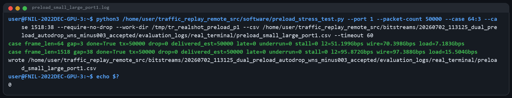

## 6. Mixed 大小包吞吐测试

测试命令：

```bash
python3 software/preload_mixed_test.py \
  --port 0 \
  --packet-count 100000 \
  --pattern 64:3,1518:38 \
  --require-no-drop
```

结果：

```text
tx=100000
drop=0
late=0
underrun=0
stall=0
debug_ticks=2050027
expected_ticks=2050000
tick_error=27
l2=92.604Gbps
wire=95.413Gbps
```

这个测试是真正交错生成 descriptor/data，不是把大包和小包拆成两组分别跑。当前 mixed 场景下，PRELOAD 能稳定接近 100G 线速，但还不是严格 100G。

真实命令行截图：

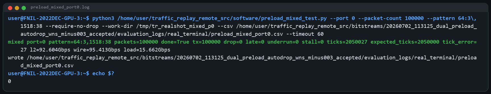

## 7. 调度精确度测试

测试命令：

```bash
python3 software/preload_precision_check.py \
  --port 0 \
  --packet-count 50000 \
  --pattern 64:3,1518:38 \
  --max-abs-tick-error 64
```

结果：

```text
expected_ticks    : 1025000
debug_ticks       : 1025027
tick_error        : 27
drop_packets      : 0
late_packets      : 0
underrun_packets  : 0
stall_events      : 0
```

`27 ticks` 在 `300MHz` tick 下约为 `90ns`。这个误差是整段 replay 的固定级别偏移，而不是随包数线性增长的 per-packet 漂移；因此当前 TX scheduler 的相对 gap 计数是稳定的。

严格意义上的“线侧发包间隔精度”还需要 RX 侧 timestamp 或 ILA 对 CMAC TX/RX 端信号采样。目前 RX capture ring 只保存截断 payload 和统计计数，还不能直接给出每个包的到达 tick。

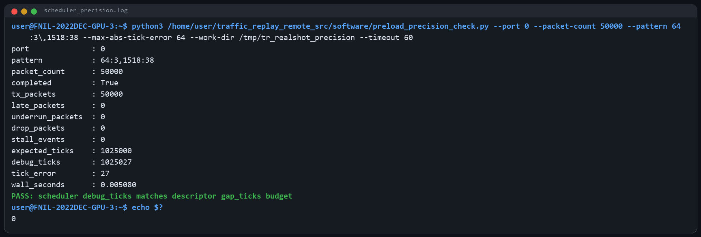

## 8. TX/RX 数据通路正确性

低速双向回环测试命令：

```bash
python3 software/loopback_rx_verify.py \
  --tx-port 0 \
  --rx-port 1 \
  --packet-count 32 \
  --frame-len 64 \
  --gap-ticks 10000 \
  --rx-ring-base 0x32000000 \
  --rx-ring-size 0x00100000

python3 software/loopback_rx_verify.py \
  --tx-port 1 \
  --rx-port 0 \
  --packet-count 32 \
  --frame-len 64 \
  --gap-ticks 10000 \
  --rx-ring-base 0x33000000 \
  --rx-ring-size 0x00100000
```

结果：

| 方向 | 结果 |
| --- | --- |
| TX0 -> QSFP0 -> 光纤 -> QSFP1 -> RX1 | `rx_packets=32`、`rx_errors=0`、`sample_mismatches=0` |
| TX1 -> QSFP1 -> 光纤 -> QSFP0 -> RX0 | `rx_packets=32`、`rx_errors=0`、`sample_mismatches=0` |

这说明两个方向的 CMAC TX/RX、光纤链路、RX sample ring 写 DDR、C2H 读回校验链路都通了。

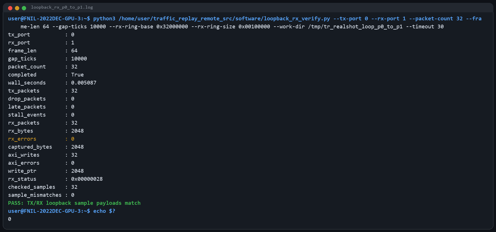

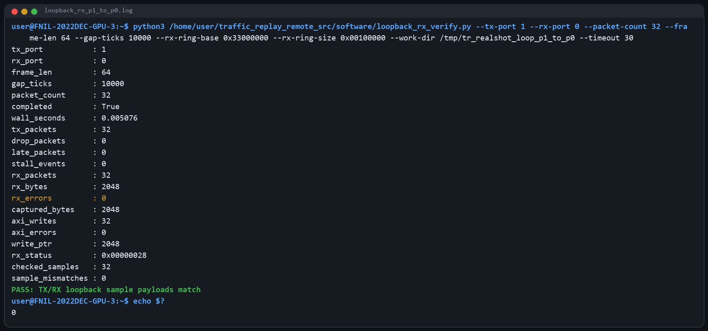

补充现象：`128B gap=2000`、`64` 包的较快/多 beat 回环中，payload 前 `64B` 全部匹配，但 `rx_errors` 非零；本轮真实终端复跑为 `rx_errors=4`，此前也观察到过 `rx_errors=8`。这说明数据内容路径是通的，但 RX LBUS/AXIS adapter 对多 beat 或较快 capture 的 error 标志处理还需要继续定位。

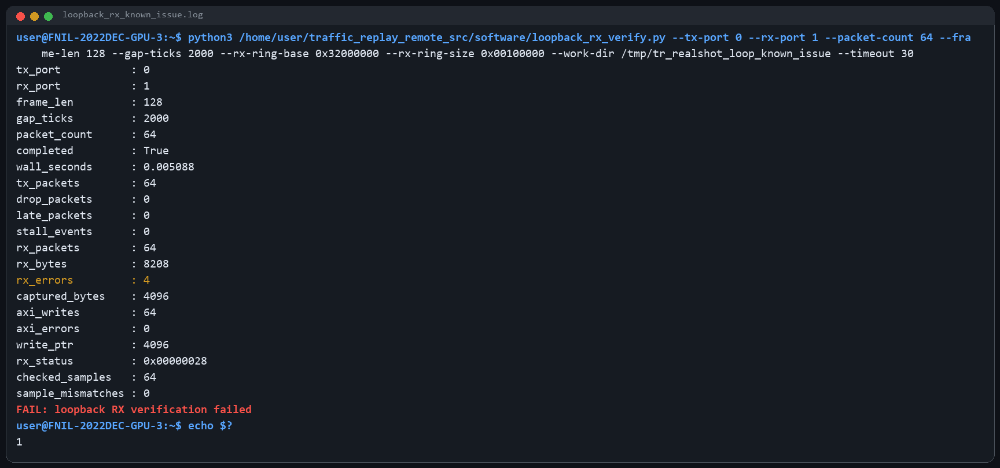

## 9. `gap=0` 鲁棒性测试

测试命令：

```bash
python3 software/preload_stress_test.py \
  --port 0 \
  --packet-count 100000 \
  --case 64:0 \
  --case 1518:0
```

结果：

| 包长 | 结果 |
| --- | --- |
| `64B gap=0` | `done=True`，`tx=100000`，`drop=95561`，`late=100000`，`stall=32` |
| `1518B gap=0` | `done=True`，`tx=100000`，`drop=100000`，`late=100000`，`stall=65` |

这个测试的目标不是无损回放，而是验证过载时系统是否会卡死。当前结果说明：

- 系统不会无限 stall 或死机。
- watchdog/auto-drop 可以把过载转成可观测计数。
- `gap=0` 后端口可能进入持续 backpressure 状态，后续严肃 no-drop 测试建议重新 clear 或重新烧录作为干净基线。

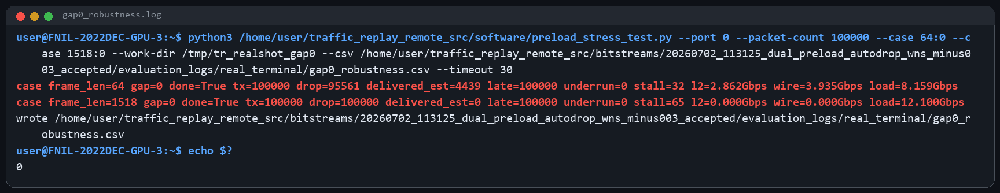

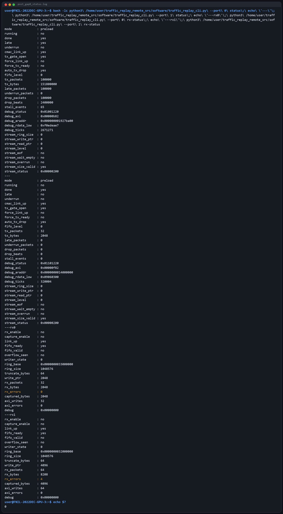

## 10. 15 分钟压力测试

测试方式：

- 关闭 RX capture。
- 端口 0/1 交替执行 mixed preload。
- 每轮 `20000` 包，pattern 为 `64:3,1518:38`。
- 每轮都要求 `drop=0 late=0 underrun=0 stall=0`。
- 总时长 `15` 分钟。

结果：

```text
elapsed_seconds: 900.186
iterations: 472
failures: 0
```

累计回放包数：

```text
472 * 20000 = 9,440,000 packets
```

每轮典型结果：

```text
mixed ... tx=20000 drop=0 late=0 underrun=0 stall=0
l2=92.599Gbps wire=95.408Gbps
```

说明：这是 repeated PRELOAD stress，不是一整条 15 分钟连续 100G trace。它主要验证长期重复装载、start/clear、双端口交替、调度器和 TX 输出路径不会随时间退化。

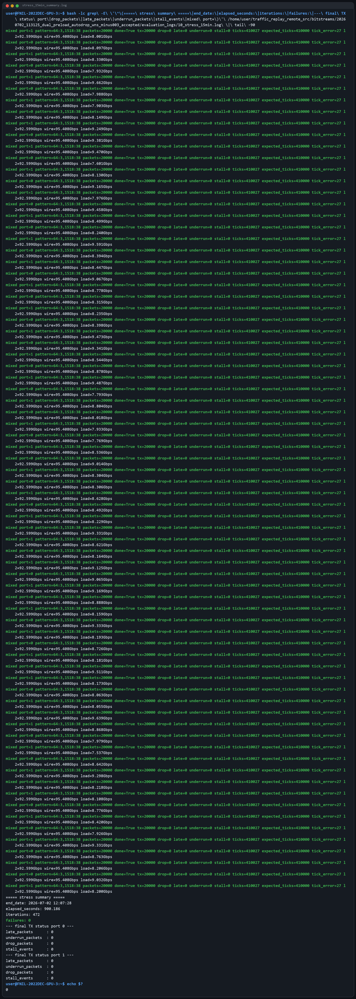

## 11. 当前已知问题

1. 当前 bitstream timing 是“接受版”，不是完全 clean timing：`WNS=-0.003 ns`。这几个皮秒很小，但从工程管理角度仍应标记为 timing violation build。
2. `gap=0` 是严重过载输入，当前设计会通过 auto-drop 退出并统计，而不是无损回放。这个行为符合鲁棒性目标，但不代表支持 `gap=0` 无损 100G。
3. RX capture 在低速 `64B` 双向回环下内容校验通过；但 `128B gap=2000` 测试出现 `rx_errors` 非零，本轮真实终端复跑为 `rx_errors=4`，虽然 sample payload 匹配。后续应重点检查 `lbus_to_axis_512` 对 `err/eop/mty` 的解释、CMAC RX error 信号语义，以及 RX capture 对多 beat 包的统计。
4. 当前 RX 侧没有 per-packet timestamp，因此还不能用 RX 侧直接测量每个包的真实到达间隔。要做严格调度精度闭环，应在 RX sample descriptor 中加入 `rx_tick`、`frame_len`、`flags`、`payload_hash/seq_id`。

## 12. 后续建议

1. 把 RX sample ring 从“纯 payload 截断”升级为“sample descriptor + payload”：每包写入 `rx_tick/frame_len/rx_flags/hash/seq_id`，这样可以从 RX 侧统计 jitter、late/early、乱序和丢包。
2. 修 RX 多 beat error：先用 ILA 抓 CMAC RX LBUS 的 `rx_errout*`、`rx_eopout*`、`rx_mtyout*`，再对照 `lbus_to_axis_512` 输出的 `tuser/tkeep/tlast`。
3. 对 `gap=0` 之后的 TX ready 恢复增加更强的软件/硬件 reset：目前 auto-drop 能避免死机，但过载后的干净恢复还不够优雅。
4. 最终 300MHz timing 仍需彻底收敛，建议继续拆 AXI/DDR reader 到 TX scheduler 的长路径，并为双端口 build 加强 placement/pblock 约束。
